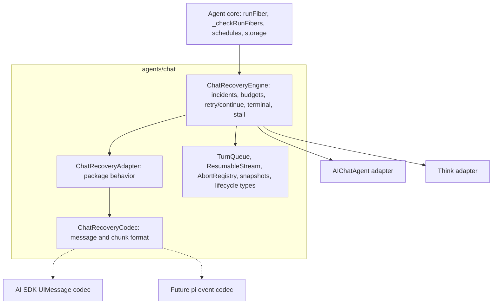
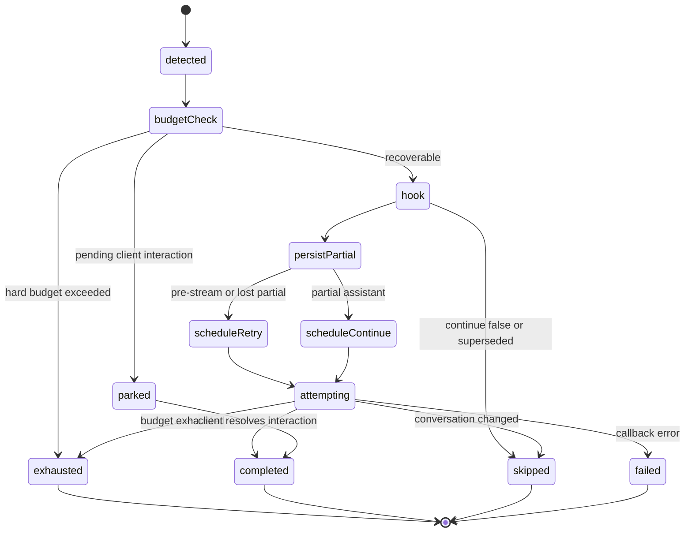
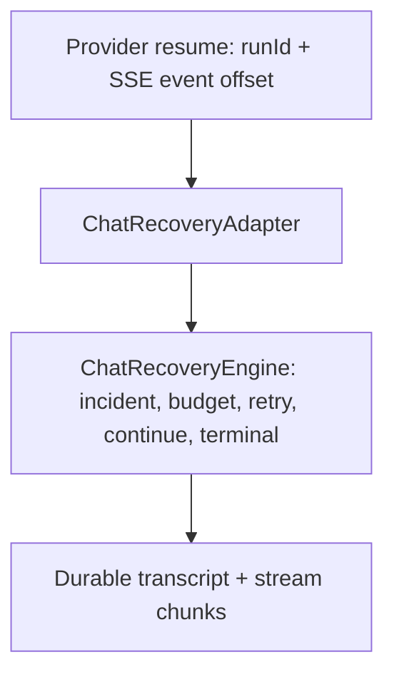

Status: proposed

# RFC: Shared chat recovery foundation

Related:

- [chat-shared-layer.md](./chat-shared-layer.md)
- [rfc-chat-recovery-work-budget.md](./rfc-chat-recovery-work-budget.md)
- [rfc-ai-chat-maintenance.md](./rfc-ai-chat-maintenance.md)
- [think-vs-aichat.md](./think-vs-aichat.md)

## The problem

`@cloudflare/ai-chat` and `@cloudflare/think` now have a sophisticated durable
chat recovery system: a turn can survive browser disconnects, Durable Object
hibernation, process death, deploy churn, partial streaming failures, pending
client tool/HITL interactions, and exhausted recovery budgets.

The underlying idea is strong, but the implementation is not in a strong
long-term shape. The durable recovery engine is duplicated across:

- [packages/ai-chat/src/index.ts](../packages/ai-chat/src/index.ts)
- [packages/think/src/think.ts](../packages/think/src/think.ts)

The shared `agents/chat` layer already owns important primitives:

- [packages/agents/src/chat/turn-queue.ts](../packages/agents/src/chat/turn-queue.ts)
- [packages/agents/src/chat/submit-concurrency.ts](../packages/agents/src/chat/submit-concurrency.ts)
- [packages/agents/src/chat/resumable-stream.ts](../packages/agents/src/chat/resumable-stream.ts)
- [packages/agents/src/chat/recovery.ts](../packages/agents/src/chat/recovery.ts)
- [packages/agents/src/chat/lifecycle.ts](../packages/agents/src/chat/lifecycle.ts)
- [packages/agents/src/chat/message-builder.ts](../packages/agents/src/chat/message-builder.ts)
- [packages/agents/src/chat/stream-accumulator.ts](../packages/agents/src/chat/stream-accumulator.ts)
- [packages/agents/src/chat/protocol.ts](../packages/agents/src/chat/protocol.ts)

The core durable execution primitive is also shared in
[packages/agents/src/index.ts](../packages/agents/src/index.ts): `runFiber`,
`_runFiberWithStashWrapper`, `_checkRunFibers`,
`_handleInternalFiberRecovery`, and `FiberRecoveryContext`.

What is not shared is the recovery orchestration policy. Both `AIChatAgent` and
`Think` carry their own copies of the same large state machine:

- `_runChatRecoveryFiber`
- `_handleInternalFiberRecovery`
- `_beginChatRecoveryIncident`
- `_chatRecoveryContinue`
- `_chatRecoveryRetry`
- `_exhaustChatRecovery`
- `_persistOrphanedStream`
- `_getPartialStreamText`
- `_bumpChatRecoveryProgress`
- terminal replay helpers
- stable-timeout reschedule helpers
- HITL park helpers
- retry-vs-continue classification
- request-context restore
- recovery observability emission

This is already causing drift. Some comments in the code explicitly say one
helper mirrors the same helper in the other package. That is a warning sign: the
recovery path is one of the highest-risk pieces of the chat stack, and it is
being maintained by copying changes between two large files.

### Recovery and hibernation layers

The current system has several related but separate recovery layers.

1. **Reconnect resume.** A browser disconnects while the Durable Object is still
   alive. The server keeps reading the provider stream, persists stream chunks
   through `ResumableStream`, and replays buffered chunks to the reconnecting
   client.

2. **WebSocket hibernation.** The Durable Object has hibernated sockets and no
   active JavaScript isolate. A later client message, reconnect, alarm, or
   platform event wakes a new isolate that must restore enough chat state to
   route the message, replay any active stream metadata, and run fiber recovery
   before user `onStart()` code can accidentally overwrite recovery context.
   This is not always a crash: a clean hibernation should not create a false
   recovery incident, but it exercises the same boot/rehydration path.

3. **Durable turn recovery.** The Durable Object isolate dies, a deploy happens,
   or the process crashes mid-turn. The provider stream reader is gone. On the
   next wake, `Agent._checkRunFibers()` detects an orphaned `runFiber` row and
   dispatches the recovery hook. The chat agent reconstructs the partial
   assistant state, persists what is safe to persist, and schedules either a
   retry or a continuation through Durable Object alarms.

All three layers matter. `ResumableStream` is already shared. WebSocket
hibernation and durable turn recovery both depend on correct wake-time
rehydration. Durable turn recovery orchestration is not shared today.

### Current shared pieces

The existing shared layer is useful but incomplete.

`packages/agents/src/chat/recovery.ts` defines `ChatFiberSnapshot` and helpers
to wrap/unwrap the initial fiber stash. It captures request identity,
continuation status, latest message IDs, `lastBody`, and `lastClientTools`.

`packages/agents/src/chat/lifecycle.ts` defines shared public types:

- `ChatRecoveryContext`
- `ChatRecoveryOptions`
- `ChatRecoveryConfig`
- `ResolvedChatRecoveryConfig`
- `ChatRecoveryExhaustedContext`
- `ChatRecoveryProgressContext`
- `SaveMessagesOptions`
- `SaveMessagesResult`
- `ChatResponseResult`
- `MessageConcurrency`

Those files describe the public shape, but they do not run recovery. The
incident state machine, scheduling, terminalization, pending-interaction
handling, orphan persistence, and retry/continue decisions still live in each
consumer package.

### Current behavioral drift

Some divergence is intentional product behavior. Some is accidental drift. Some
is an improvement that should be shared.

Important differences today include:

- `Think` has a live stall watchdog (`_iterateWithStallWatchdog`,
  `_routeStallToBoundedRecovery`, `ChatStreamStalledError`) that routes an
  in-isolate stalled stream into the same bounded recovery path. `AIChatAgent`
  does not have equivalent protection.
- `Think` defaults `chatRecovery` to `true`; `AIChatAgent` defaults it to
  `false`.
- `Think` replays recovering state on connect; `AIChatAgent` did not — converged
  in slice 2d (`AIChatAgent` now replays it too; see the progress log).
- `Think` has stronger recovery callback error handling.
- `Think` has durable submission recovery and must complete, skip, or park
  submissions correctly.
- `AIChatAgent` has client/server reconciliation behavior required by the AI SDK
  React client, which `Think` mostly avoids through its Session persistence
  model.
- Progress accounting differs: `AIChatAgent` records progress on meaningful
  chunks, while `Think` often records progress around durable chunk flushes and
  tool-output paths.
- Terminal delivery ordering differs: `AIChatAgent` records terminal state
  before broadcasting, while `Think` favors a broadcast-first path in parts of
  the exhaustion flow for deploy/storage-failure resilience.

The goal is not to preserve every difference forever behind an abstraction. When
one implementation has better behavior, we should converge both packages on that
behavior intentionally, with tests and release notes.

### AI SDK coupling

The implementation is currently AI SDK oriented, but not every part is AI SDK
specific.

AI SDK specific pieces include:

- `UIMessage` and `UIMessageChunk`
- `toUIMessageStream()` / `toUIMessageStreamResponse()` stream shape
- chunk-to-parts assembly in `message-builder.ts`
- `StreamAccumulator`
- `convertToModelMessages` and continuation checkpoint repair in `Think`
- client-side `@ai-sdk/react` transport behavior
- client/server assistant ID reconciliation in `AIChatAgent`
- tool part states such as `input-available`, `output-available`,
  `approval-requested`, and dynamic tool parts

Generic pieces include:

- serialized turn queueing
- submit concurrency policies
- abort registry
- resumable stream byte storage
- fiber snapshots
- incident budgets
- progress/work accounting
- alarm scheduling
- terminal replay via WebSocket resume handshake
- recovering-state delivery
- observability event names
- retry-vs-continue orchestration

This suggests a split: the shared recovery engine should be format-agnostic
where possible, but the seam cannot be just a message/chunk codec. Much of the
current variance is behavioral: persistence model, HITL semantics, submission
lifecycle, terminal UX, and reconnect policy.

## The proposal

Introduce a shared, internal, composition-based recovery foundation in
`packages/agents/src/chat`.

The foundation has three conceptual parts:

1. `ChatRecoveryEngine` - shared policy and orchestration.
2. `ChatRecoveryAdapter` - package-specific behavior and host operations.
3. `ChatRecoveryCodec` - message/chunk format normalization, initially AI SDK
   oriented and later extensible to other harnesses.

The engine should be treated as sibling-package support, not as a public API for
application developers. Users should continue to interact with:

- `chatRecovery`
- `onChatRecovery`
- `onExhausted`
- `shouldKeepRecovering`
- `stash()`
- `continueLastTurn`
- existing `AIChatAgent` and `Think` APIs

There should be no new app-developer import required to get recovery behavior.

### Shape of the engine

`ChatRecoveryEngine` owns the durable recovery state machine.

Responsibilities:

- Wrap chat turns in durable fibers through the adapter's fiber seam.
- Detect and classify recovered chat fibers.
- Create and update `ChatRecoveryIncident` records.
- Apply attempt, no-progress, work-budget, and caller-predicate limits.
- Keep retry and continue attempts under one incident identity.
- Debounce deploy storms so repeated wakes do not burn the attempt budget.
- Park recovery when the turn is waiting on a client/HITL interaction.
- Decide _whether_ to persist a recoverable orphan partial (the adapter does the
  write; see "Persist-orphan boundary" below).
- Schedule `_chatRecoveryContinue` or `_chatRecoveryRetry`.
- Reschedule after stable-timeout churn without self-deduping the alarm row.
- Terminalize exhausted recovery and invoke `onExhausted`.
- Preserve the terminal replay path used by `useAgentChat`.
- Emit `chat:recovery:*` observability events with compatible payloads.
- Coordinate optional live stall recovery.
- Handle recovery callback errors consistently.

It should not own:

- The public `onChatMessage` contract.
- Provider invocation.
- AI SDK `UIMessage` semantics.
- The package's canonical message store.
- `Think` Session internals.
- `AIChatAgent` message reconciliation.
- `Think` durable submission lifecycle.
- WebSocket protocol parsing outside recovery-specific frames.
- Public defaults for `chatRecovery`.

### Recovery surface map

Recovery is not a single entry point. The current code reaches recovery-adjacent
logic from several places, and the refactor must be explicit about which layer
owns each one. Otherwise the extraction silently drops a `Think`-only path.

| Surface                           | Today                                                                                                                | Ownership after refactor                                                                |
| --------------------------------- | -------------------------------------------------------------------------------------------------------------------- | --------------------------------------------------------------------------------------- |
| Fiber recovery on wake            | `Agent._checkRunFibers()` -> `_handleInternalFiberRecovery` in each package                                          | Engine. Dispatched through the adapter's fiber seam.                                    |
| Incident lifecycle and budgets    | `_beginChatRecoveryIncident`, progress, attempt/work limits                                                          | Engine.                                                                                 |
| Retry vs continue scheduling      | `_chatRecoveryContinue`, `_chatRecoveryRetry`                                                                        | Engine policy; adapter executes the actual turn.                                        |
| Terminalization and replay        | `_exhaustChatRecovery`, `_recordChatTerminal`, `_replayTerminalOnResume`                                             | Engine policy; adapter delivers UX.                                                     |
| Messenger/workflow fiber dispatch | `Think` delegates first: `_messengerRuntime?.handleFiberRecovery(ctx)` ([think.ts](../packages/think/src/think.ts))  | Adapter. Runs before chat recovery via `tryHandleNonChatFiberRecovery`.                 |
| Durable submission drain          | `Think` constructor + submission lifecycle hooks                                                                     | Adapter. Engine provides hooks; `AIChatAgent` adapter no-ops.                           |
| Agent-tool child-run reconcile    | `_reconcileOwnStaleAgentToolChildRuns` in both packages                                                              | Adapter. Engine calls it after recovery completes.                                      |
| Resume-ACK orphan persist         | `_persistOrphanedStream` reached from a resume ACK (not a fiber) ([ai-chat index](../packages/ai-chat/src/index.ts)) | Adapter (reconnect-resume layer). Shares the adapter orphan writer with fiber recovery. |
| Live stall route                  | `Think._routeStallToBoundedRecovery`                                                                                 | Adapter input into engine; opens an incident sharing identity with deploy recovery.     |

Explicit non-goals for this refactor (named so reviewers know they are out of
scope, not forgotten):

- Parent agent-tool re-attach (`Agent._scheduleAgentToolRunRecovery`) stays in
  `Agent`. The only constraint is an ordering invariant: chat fiber recovery runs
  before user `onStart()` and before parent agent-tool re-attach on wake.
- Context-overflow compact-and-retry inside the inference loop is a different
  failure class and stays in `Think`.
- Facet/sub-agent fiber recovery (`Agent._checkFacetRunFibers`) is out of scope.
- `onStart` media/`SQLITE_NOMEM` boot degradation stays package-owned; recovery
  classification must read durable state where the in-memory cache is degraded
  (see "Boot-time degraded reads" below).

### Adapter seam

`ChatRecoveryAdapter` is the main seam. It is behavioral, not just a codec.

Illustrative shape:

```ts
type ChatRecoveryAdapter = {
  readonly name: "AIChatAgent" | "Think" | string;
  readonly snapshotKind: string;
  // New snapshots are written under one shared envelope key
  // (`__cfChatFiberSnapshot`, owned by the engine). Adapters only list their
  // legacy per-package keys so pre-cutover rows still unwrap on read.
  readonly legacySnapshotEnvelopeKeys: readonly string[];
  readonly chatFiberName: string;

  getRecoveryConfig(): ResolvedChatRecoveryConfig;
  getMessages(): unknown[];
  getLatestLeaf(): Promise<RecoveredLeaf | null>;
  findLatestUserMessage(): Promise<RecoveredUserMessage | null>;

  restoreRecoveredRequestContext(ctx: RecoveredRequestContext): Promise<void>;
  rehydrateBeforeBudgetCheck?(): Promise<void>;

  // Post-v1 extension. Not implemented in the first ship. The engine is designed
  // to accommodate provider-level resume via opaque outcomes (see "Relationship
  // to Workers AI Gateway resume"), but v1 ships transcript-level recovery only.
  getProviderResumeCheckpoint?(): Promise<ProviderResumeCheckpoint | null>;
  tryProviderResume?(input: ProviderResumeInput): Promise<ProviderResumeResult>;

  // Non-chat fibers (messenger/workflow) get first refusal before chat recovery.
  tryHandleNonChatFiberRecovery?(ctx: FiberRecoveryContext): Promise<boolean>;

  // Classification is adapter-owned: stream-terminal alone is not enough.
  classifyRecoveredTurn(input: ClassifyRecoveredTurnInput): Promise<{
    kind: "retry" | "continue" | "skip";
    retryTargetUserId?: string;
    targetAssistantId?: string;
    skipReason?: string;
  }>;

  resolveStreamForRecovery(requestId: string): Promise<{
    streamId: string | null;
    streamStillActive: boolean;
    streamIsTerminal: boolean;
  }>;
  getPartialForStream(streamId: string): Promise<RecoveredPartial>;
  persistOrphanPartial(input: OrphanPersistInput): Promise<void>;
  completeOrphanStream?(streamId: string): Promise<void>;

  hasPendingInteractionForStable(): Promise<boolean>;
  hasPendingInteractionForBudget(): Promise<boolean>;
  parkForPendingInteraction(input: ParkRecoveryInput): Promise<void>;

  continueRecoveredTurn(
    input: ContinueRecoveryInput
  ): Promise<RecoveryTurnResult>;
  retryRecoveredUserTurn(
    input: RetryRecoveryInput
  ): Promise<RecoveryTurnResult>;
  handleConversationSuperseded(input: SupersededRecoveryInput): Promise<void>;

  // Durable submissions (Think). ai-chat adapter no-ops, but the engine must not
  // assume submissions are absent.
  completeSubmissionAfterRecovery?(
    input: SubmissionRecoveryInput
  ): Promise<void>;
  markSubmissionInterrupted?(input: SubmissionRecoveryInput): Promise<void>;

  // Stale agent-tool child runs after a recovered parent turn.
  reconcileAgentToolRunsAfterRecovery?(): Promise<void>;

  // Forward progress is recorded at stream production time, never on replay.
  onForwardProgressAtProductionTime(input: ForwardProgressInput): Promise<void>;

  // Scheduled-callback failures: distinguish app failure from platform transient.
  handleScheduledRecoveryError(
    input: ScheduledRecoveryErrorInput
  ): Promise<ScheduledRecoveryErrorOutcome>;

  setRecovering(input: RecoveringStateInput): Promise<void>;
  deliverTerminal(input: TerminalDeliveryInput): Promise<void>;
  replayTerminalOnResume(input: TerminalReplayInput): Promise<boolean>;

  onRecoveryEvent(input: RecoveryEventInput): void;
  log(level: "info" | "warn" | "error", message: string, meta?: unknown): void;

  // Host operations. The agent that implements the adapter is also the host, so
  // there is no separate `ChatRecoveryHost` type. These let the engine run the
  // state machine and stay unit-testable against a fake adapter (fake storage,
  // fake scheduler, deterministic clock) with no Workers runtime.
  schedule(
    delaySeconds: number,
    callback: "_chatRecoveryContinue" | "_chatRecoveryRetry",
    data: unknown,
    opts: { idempotent: boolean }
  ): Promise<void>;
  storageGet<T>(key: string): Promise<T | undefined>;
  storagePut<T>(key: string, value: T): Promise<void>;
  storageDelete(key: string): Promise<void>;
  storageList<T>(opts: { prefix: string }): Promise<Map<string, T>>;
  invokeOnChatRecovery(
    ctx: ChatRecoveryContext
  ): Promise<ChatRecoveryOptions | void>;
  getResumableStream(): ResumableStreamHandle;
};
```

The new methods reflect behavior that already exists in code but did not map onto
the original sketch:

- `classifyRecoveredTurn` replaces implicit retry-vs-continue logic. A
  stream-terminal check alone is not sufficient: `Think` also consults
  `_shouldPersistOrphanedPartial` and `_hasPersistedRecoveredAssistant`, and
  `AIChatAgent` uses `_shouldRetryRecoveredPreStreamTurn`. The adapter returns the
  decision; the engine applies budgets and scheduling.
- `tryHandleNonChatFiberRecovery` preserves `Think`'s ordering where messenger and
  workflow fibers are dispatched before chat recovery claims a recovered fiber.
- `completeSubmissionAfterRecovery` / `markSubmissionInterrupted` extend
  `ContinueRecoveryInput` / `RetryRecoveryInput` with submission fields (such as
  `Think`'s `recoveredRequestId`). The engine threads them through scheduling; the
  `AIChatAgent` adapter leaves them unimplemented.
- `reconcileAgentToolRunsAfterRecovery` keeps `_reconcileOwnStaleAgentToolChildRuns`
  behavior under the adapter.
- `onForwardProgressAtProductionTime` makes explicit that progress is bumped from
  streaming/codec hooks while the turn is producing output, not from recovery
  replay or re-persisting already-stored chunks.
- `handleScheduledRecoveryError` converges both packages on `Think`'s stronger
  callback-error handling (app error terminalizes/marks failed; platform transient
  defers and reschedules without sealing the incident).

The actual interface should be smaller than this sketch if implementation shows
some operations can be derived rather than supplied. The important point is that
the seam must cover behavior and host I/O, not only message parsing. Because the
agent class is both the adapter and the host, the engine is constructed as
`new ChatRecoveryEngine(adapter)` with a single object - there is no second host
seam to wire.

Adapter-owned behaviors:

- How to inspect the latest persisted leaf.
- How to determine whether a pre-stream turn is retryable.
- How to reconstruct partial text/parts from stored stream chunks.
- How to preserve settled tool results even when `persist: false`.
- How to restore `lastBody`, `lastClientTools`, and stash data.
- (Post-v1) How to persist and restore provider-level resume checkpoints such as
  Workers AI Gateway `{ runId, eventOffset }`, and how to attempt provider-level
  byte-exact resume before falling back to transcript-level continuation.
- How to detect pending client/HITL interactions.
- How to wait for stable state before continuing.
- How to call `continueLastTurn` or retry the last user turn.
- How to reconcile or skip if the conversation changed.
- How to complete, skip, or park durable submissions.
- How to deliver recovering and terminal UX.
- How to record progress under package-specific streaming semantics.
- How to reconcile stale agent-tool child runs after recovery.

### Codec seam

`ChatRecoveryCodec<TMessage, TChunk>` is a narrower seam under the adapter.

It should contain only format knowledge:

- parse serialized chunk body
- serialize chunk body
- classify progress-bearing chunks
- classify replay chunks
- reconstruct a partial assistant from chunk bodies
- repair interrupted tool parts
- determine whether a message contains settled tool results
- find latest user/assistant messages if the transcript shape is generic enough
- normalize continuation checkpoints if the provider rejects assistant prefill

The initial codec will be AI SDK oriented and can reuse existing primitives:

- `applyChunkToParts`
- `StreamAccumulator`
- `sanitizeMessage`
- `enforceRowSizeLimit`
- `isReplayChunk`
- `normalizeToolInput`

This keeps the engine open to a future non-AI-SDK harness without pretending
that today's system is already fully generic.

### Persist-orphan boundary

Persisting an orphaned partial is the place where the "engine owns policy,
adapter owns the store" split is easiest to get wrong. In code today,
`_persistOrphanedStream` reconstructs messages, merges by message id /
`toolCallId`, writes the transcript, and (in `Think`) broadcasts. That is store
knowledge, not policy. The boundary should be three explicit responsibilities:

1. **Adapter reports state.** `resolveStreamForRecovery(requestId)` returns
   `{ streamId, streamStillActive, streamIsTerminal }`, and `getPartialForStream`
   returns the reconstructed partial. This is the only way the engine learns
   about the stream.
2. **Engine decides.** `shouldPersistOrphan(flags)` is engine policy over
   adapter-supplied flags only (`streamStillActive`, `streamIsTerminal`,
   `hasPartial`, `hookOptions`, `hasSettledToolResults`). The engine never reads
   the transcript directly.
3. **Adapter writes.** `persistOrphanPartial` is the sole transcript writer. It
   owns merge/reconcile/broadcast, stream-metadata message-id resolution, and
   preserving settled tool results even when `onChatRecovery` returns
   `{ persist: false }`.

The reconnect-resume layer reaches the same `persistOrphanPartial` writer from a
resume ACK rather than from fiber recovery. That path is adapter-owned and shares
the writer so the two layers cannot diverge on how an orphan is persisted.

### Architecture



### Recovery state machine

The shared engine should make this state machine explicit and testable:



### Public API stance

This RFC does not propose a new public recovery API.

`ChatRecoveryEngine`, `ChatRecoveryAdapter`, and `ChatRecoveryCodec` are internal
sibling-package support. They are marked `@internal`, not exported from the
`agents` package root, and not documented for application developers. We own all
the consumers (`AIChatAgent`, `Think`, and the internal pi validation adapter),
so there is no reason to expose them. If a barrel re-export is needed for build
reasons, it stays `@internal`. Promoting any of these to a public API is a
separate future decision, not part of this refactor.

Existing public hooks and config remain the supported surface:

```ts
chatRecovery: ChatRecoveryConfig;

protected onChatRecovery(
  ctx: ChatRecoveryContext
): Promise<ChatRecoveryOptions | void>;
```

`ChatRecoveryConfig` remains class-field or constructor configuration. The
existing warning remains important: recovery budgets are evaluated before
`onStart()` runs after a wake, so assigning `chatRecovery` in `onStart()` is too
late for the interrupted turn that matters.

## Better-behavior convergence

The refactor should not preserve every current divergence as permanent adapter
policy. When one package has clearly better recovery behavior, both packages
should converge on that behavior intentionally.

### Convergence matrix

| Area                           | Current `AIChatAgent`                                                                                           | Current `Think`                                                                                          | Proposed shared behavior                                                                                                                                                            |
| ------------------------------ | --------------------------------------------------------------------------------------------------------------- | -------------------------------------------------------------------------------------------------------- | ----------------------------------------------------------------------------------------------------------------------------------------------------------------------------------- |
| Durable recovery default       | `chatRecovery = false`                                                                                          | `chatRecovery = true`                                                                                    | Keep defaults per package unless a separate semver-visible RFC changes them. The engine does not own defaults.                                                                      |
| Live stalled stream            | No bounded stall watchdog                                                                                       | Routes stalls into bounded recovery                                                                      | Adopt shared stall recovery in both packages, enabled by default when `chatRecovery` is on. `AIChatAgent` gains a default stall timeout. Changeset required.                        |
| Recovery callback errors       | Less complete handling                                                                                          | Stronger callback-error handling                                                                         | Adopt Think's stronger behavior for both packages: app errors terminalize or mark failed consistently; platform transients can defer.                                               |
| Recovering state on reconnect  | Not replayed on connect → now replayed (slice 2d)                                                               | Replayed on connect                                                                                      | DONE (slice 2d): `AIChatAgent` converged onto Think's replay-on-connect UX; shipped as a user-visible behavior change (minor changeset).                                            |
| Terminal delivery              | Resume handshake, persist-first in main path                                                                    | Resume handshake, some broadcast-first resilience                                                        | Keep resume-handshake delivery. Converge on terminal-before-seal ordering (durably record/deliver before sealing the incident); duplicate delivery tolerated, lost delivery is not. |
| Pending interaction predicates | Split stable wait vs client-budget predicate                                                                    | More client-focused predicate                                                                            | Converge on split predicates so server-tool stability and client/HITL budget exemption are not conflated.                                                                           |
| Auto-continuation barrier      | Barrier inside the continuation turn; fixed 60s timeout then continues against an incomplete tool batch (#1649) | Event-driven barrier before enqueue; stream-gated; no orphan timeout; waits for batch completion (#1650) | Adopt Think's event-driven, no-timeout, stream-gated barrier in both packages. `AIChatAgent` drops the 60s force-continue. Changeset required. See decision below.                  |
| Durable submissions            | Not applicable                                                                                                  | Must recover, park, complete, skip, or exhaust submissions                                               | Keep as adapter-owned Think behavior. The engine provides hooks; `AIChatAgent` adapter no-ops.                                                                                      |
| Message reconciliation         | Required for AI SDK client IDs                                                                                  | Session persistence avoids much of it                                                                    | Keep adapter-owned. Do not force Think into ai-chat reconciliation.                                                                                                                 |
| Progress accounting            | Meaningful chunk types                                                                                          | Durable flush/tool-output oriented                                                                       | Converge on one progress policy: bump only on new forward work at production time, never on replay/re-persist. Land with budget tests proving no regressions.                       |
| Terminal exhausted callback    | Existing public hook                                                                                            | Existing public hook plus durable-work effects                                                           | Shared engine invokes hook, but adapter owns durable side effects.                                                                                                                  |

### Behavior decisions

#### Adopt shared stall recovery

`Think` can detect a live stream that is not making progress and route it into
bounded recovery. This is better than waiting for a deploy or isolate death to
surface the problem.

The shared engine supports stall detection as an input path into the same
incident budget machinery, and both packages use it.

Decision: `AIChatAgent` enables a default stall timeout when `chatRecovery` is
enabled, matching `Think`. We own both packages, so there is no reason to ship the
capability dark and flip it later; we converge now and cover it with a changeset
and tests. The stall timeout is configurable, so an app can tune or disable it.

#### Adopt stronger callback-error handling

Recovery callbacks can fail for two broad reasons:

- application-level failure: the recovered turn really failed and should be
  terminalized or marked failed
- platform/transient failure: storage, scheduling, or deploy churn interrupted
  the recovery callback itself

The shared engine should preserve the stronger behavior currently present in
`Think`: terminal UX should be delivered when the turn is unrecoverable, but
platform transients should not permanently seal the incident before terminal
state is durably delivered.

This is a correctness improvement for `AIChatAgent`.

#### Adopt Think's event-driven auto-continuation barrier

When a turn ends with parallel client tool calls still outstanding, the agent must
wait for every tool result before auto-continuing, or it continues inference against
an incomplete batch. The two packages solved this differently:

- **`AIChatAgent` (#1649):** the barrier runs _inside_ the exclusive continuation
  turn (`_awaitPendingInteractionBarrier`, `index.ts:2443–2471`), polling for
  completion with a fixed `AUTO_CONTINUATION_PENDING_TOOL_TIMEOUT_MS = 60_000`
  timeout, after which it proceeds with whatever arrived. The continuation is queued
  via `_enqueueAutoContinuation` → `_queueAutoContinuation` → `onChatMessage`.
- **`Think` (#1650):** the barrier is _event-driven and runs before enqueue_
  (`_scheduleAutoContinuation` → `_fireAutoContinuationWhenStable` →
  `_drainInteractionApplies`, `think.ts:10771–10961`). It returns without firing if
  the batch is incomplete (`_hasIncompleteToolBatch`), re-arms on the next applied
  result (`_rearmPendingAutoContinuationForBatch`, `_onStreamingTurnFinalized`), is
  gated on no active stream (`_streamingAssistant`), guards against double-fire
  (`_continuationBarrierActive`), and has **no orphan timeout** — an incomplete batch
  simply never auto-continues until it completes.

Decision: converge both packages onto Think's event-driven model. It is strictly
better — it never fires inference against a half-complete tool batch, and it removes
the arbitrary 60s window after which `AIChatAgent` currently continues with missing
results.

Scope — this is a substantial `AIChatAgent` slice, NOT a near-trivial follow-on to
Slice 4f. A code read (2026-06) found ai-chat's barrier is wired into a whole
continuation state machine and depends structurally on running _inside the exclusive
turn_; its own docblock (`index.ts:2437–2441`) explains it needs no concurrent-entry
guard precisely because "this runs inside the exclusive continuation turn … so the
turn queue serializes barrier waits." Moving to Think's model therefore requires more
than dropping the timeout. `AIChatAgent` must:

- Move the barrier _out_ of the continuation turn and make it event-driven before
  enqueue (the `_scheduleAutoContinuation` → `_fireAutoContinuationWhenStable` shape),
  dropping `_awaitPendingInteractionBarrier`, the in-turn poll, and
  `AUTO_CONTINUATION_PENDING_TOOL_TIMEOUT_MS`.
- **Add** a `_continuationBarrierActive`-style double-fire guard. This becomes
  load-bearing once the work leaves the turn — today the turn queue is what serializes
  barrier waits, so removing the in-turn barrier removes that guarantee.
- **Add** a stream-active gate + a stream-finalize re-arm hook. Think hangs these on
  `_streamingAssistant` / `_onStreamingTurnFinalized` in its `toUIMessageStream()`
  loop; ai-chat's streaming loop is the SSE reader (`_streamSSEReply` / `_reply`), so
  there is no equivalent finalize point — one has to be introduced in the SSE loop.
- **Reconcile** ai-chat's `_continuation` coalesce / `prerequisite` / deferred
  machinery (`_enqueueAutoContinuation`, `_mergeAutoContinuationPrerequisite`,
  `_storeDeferredAutoContinuation`, `_activateDeferredAutoContinuation`) with Think's
  re-arm-on-apply model — Think has no direct analogue, so this is a behavior mapping,
  not a delete.

The only piece Slice 4f contributes is the shared leaf `_hasIncompleteToolBatch`
(verified byte-identical, lifted in 4f). 4f is a prerequisite, not the bulk of the
work.

Risk + scope: this changes `AIChatAgent`'s user-visible timing — a stuck or
never-arriving tool result that previously force-continued after 60s now parks
indefinitely until the batch completes (matching Think, and matching how a pending
HITL/client interaction already parks). That is the intended behavior, but it is a
semver-minor behavior change and ships with a changeset. e2e coverage must include,
beyond the obvious parallel-tool-call completion case: (1) a never-completing-tool
case (confirm it parks, does not force-continue, and stays budget-free the same way
`hasPendingClientInteraction` parking does); and critically (2) a **deploy/crash
mid-park** case — confirm chat-recovery _re-arms_ the parked continuation rather than
exhausting it or false-terminalizing, since ai-chat's recovery path may currently
assume the timeout model. Sequence it as its own slice **after Slice 4f** — it is
independent of Phase 5, but note a soft coupling: the SSE-loop finalize hook lands in
the same streaming region the Tier-2 codec extraction will touch, so if Phase 5 runs
close behind, coordinate the two rather than adding a hook the codec work then moves.
The orchestration stays package-local for now (it is NOT routed through
`ChatRecoveryEngine`); only the leaf predicate is shared. A future slice may lift the
converged barrier into `agents/chat` once both packages run the identical algorithm —
track that as a follow-up, not part of this decision.

#### Prefer recovering replay on connect

If a client reconnects while recovery is already in progress, the better UX is
to know the server is recovering rather than appearing idle.

The shared behavior should replay recovering state on connect for both packages,
while still clearing it on completion, exhaustion, skipped recovery, or HITL
park. Because this changes `AIChatAgent` client-visible state, it should be
called out in the changelog.

#### Preserve terminal delivery through resume handshake

Terminal recovery errors should continue to be delivered through the stream
resume handshake:

1. server reports a stream is resumable
2. client sends resume ACK
3. server replays errored chunks and sends a terminal error frame
4. `useAgentChat` receives the error through its active transport stream

Bare connect frames are not enough because they do not flow through the
transport stream reader in the right way.

#### Preserve settled tool results

`onChatRecovery` may return `{ persist: false }`, but settled tool results must
not be dropped. Tool outputs are often side effects that already happened. The
shared engine should treat "do not persist partial text" and "drop settled tool
results" as different decisions.

#### Keep retry and continue under one incident identity

The current recovery identity intentionally excludes `recoveryKind`. An incident
can begin as a retry and later become a continue, or vice versa, without
resetting budgets. The shared engine should preserve this.

#### Keep schedule callback names stable

The scheduled callback names `_chatRecoveryContinue` and `_chatRecoveryRetry`
are effectively persisted data while a recovery is outstanding. Both packages
schedule recovery against those names, so the alarm rows in `cf_agents_schedules`
reference them by string. In addition, `Think` reads those rows back in
production through `_hasScheduledRecoveredContinuation`
([packages/think/src/think.ts](../packages/think/src/think.ts)), which queries
`WHERE callback = '_chatRecoveryContinue'`; `AIChatAgent` only queries those rows
in test helpers today. Either way, renaming the callbacks would strand old
schedule rows and break in-flight deploys. The engine may move logic behind those
callbacks, but the callback names should remain stable unless there is an
explicit migration.

## Edge-case invariants

These invariants should be treated as design constraints and test requirements.

### Boot order

`Agent._checkRunFibers()` runs on wake before user `onStart()`. Recovery config,
client-tool rehydration needed for recovery classification, and adapter
initialization must be available before budget evaluation.

### Boot-time degraded reads

Recovery classification reads the latest leaf during `_checkRunFibers`, before
`onStart()`. If `Think`'s in-memory message view is degraded after a boot failure
(for example media hydration or `SQLITE_NOMEM` degradation), the in-memory
transcript may not match durable state. `getLatestLeaf()` and
`classifyRecoveredTurn` must read durable transcript state, not a possibly empty
in-memory cache, so a degraded boot does not misclassify a recoverable turn.

### Hibernation wake order

WebSocket hibernation is a normal Durable Object lifecycle path, not only a
failure path. A hibernated object can wake because:

- a connected hibernated WebSocket sends a message
- a browser reconnects and asks to resume a stream
- a scheduled recovery alarm fires
- a platform event recreates the isolate

The shared engine must make this wake path explicit. On wake, the adapter should
restore stream metadata, recovering/terminal flags, request context, client tool
schemas, and any package-specific durable work state before recovery makes
budget or retry/continue decisions.

A clean hibernation with no orphaned fiber should not create a recovery incident
or bump recovery progress. A hibernation wake that discovers an orphaned chat
fiber should follow the same durable turn recovery path as deploy/process death.

### Hibernated sockets and active streams

Hibernated WebSockets can outlive the isolate that created them. Recovery must
not assume in-memory connection sets, pending resume connections, active stream
objects, or `_streamingMessage` references survive hibernation. Durable metadata
must be the source of truth after wake.

Client-visible behavior should remain consistent across hibernation:

- a resume request after hibernation should either replay durable chunks, report
  no resumable stream, or deliver terminal replay through the ACK path
- recovering state should be replayed according to the chosen shared behavior
- hibernation without active recovery should not show a false recovering state
- hibernation should not duplicate assistant messages or stream chunks

### ACK versus fiber recovery race

A reconnect ACK can cause `ResumableStream.replayChunks()` to finalize an
orphaned stream while the fiber recovery path is also inspecting the same
stream. Recovery must check whether the stream is still active before persisting
or finalizing the orphan partial.

### Pre-stream retry

If eviction happens before any assistant stream chunk is durably observed, the
correct behavior is usually retrying the last user turn rather than continuing a
nonexistent assistant. But the retry is only safe when the latest persisted leaf
is still the relevant user message and the stream metadata does not prove a
terminal assistant already exists.

### Partial assistant continue

If any recoverable assistant partial exists, recovery should persist it when
safe and continue from the last assistant state. Continuing must not merge into
the wrong assistant message. Stream metadata message IDs are important.

### Conversation supersession

If a user or client changed the conversation after the interrupted turn, the
recovery continuation may be stale. `AIChatAgent` and `Think` have different
side effects here because `Think` has durable submissions. The shared engine
should route this through adapter hooks.

### HITL and client tools

Pending client interactions are not stuck server work. They should not burn the
no-progress or attempt budget. Recovery should park and wait for the client
interaction to resolve.

The adapter needs two predicates:

- "Is the system stable enough to start a recovery continuation?"
- "Is this recovery budget-free because it is waiting on a client?"

Those are related but not identical.

### Stable-timeout rescheduling

Initial recovery schedules should be idempotent so deploy storms do not enqueue
many duplicate continuations.

Stable-timeout reschedules must not be idempotent against the currently
executing one-shot schedule row. If they are idempotent, they can dedupe
themselves and never fire.

### Terminal before seal

When recovery exhausts, terminal state must be delivered or durably recorded
before the incident is sealed as exhausted. If a platform transient interrupts
terminal delivery, the system should retry the give-up path rather than mark the
incident done and lose the terminal UX.

Duplicate terminal delivery is acceptable. Lost terminal delivery is not.

### Progress semantics

The progress counter is the basis for no-progress timeout reset and
`maxRecoveryWork`. It must not be bumped by mere replay or by reconstructing a
partial from already persisted chunks. It should be bumped only when the system
observes new forward work according to adapter policy.

### Provider-resume checkpoints (post-v1)

This is a forward-looking extension, not part of the first ship. It is documented
here so v1 does not paint itself into a corner. The engine vocabulary below must
exist from day one; the adapter implementation lands later.

Some providers can resume the upstream model stream directly. The Workers AI
Gateway merge RFC documents this for run-catalog models: the run path can return
`cf-aig-run-id`, and `resume(from=N)` replays from an SSE event index.

Those provider-level checkpoints are valuable but not sufficient on their own.
They should be treated as an adapter-owned fast path under chat recovery:

- the adapter persists `{ runId, eventOffset }` or an equivalent checkpoint as
  the stream advances
- hibernation wake and fiber recovery restore the checkpoint before
  retry/continue classification
- recovery first tries byte-exact provider resume when the checkpoint is valid
- if provider resume is expired or unavailable, recovery falls back to persisted
  partial + semantic continuation, retry, accept-partial, or terminalization

Provider resume replay must not double-count chat recovery progress for events
that were already emitted and persisted before interruption. Progress should
advance only when the resumed provider stream emits new complete events beyond
the persisted offset.

### Resume capability honesty

Provider capabilities vary. The Workers AI Gateway RFC calls out a current
transport split: the run path can provide resume (`cf-aig-run-id`) while the
gateway path provides server-side fallback/caching/log IDs but no run ID.

The chat recovery layer should not hide that trade-off. If the selected model
transport cannot provide provider-level resume, the adapter should report no
provider checkpoint and the shared engine should go directly to transcript-level
recovery. If a user requested an option that disables provider resume, that
belongs in provider/model configuration warnings, not in the chat recovery
engine.

### Terminal replay retention

Terminal records should survive connection drops during replay. If a client
drops mid-terminal replay, a later reconnect should still be able to receive the
terminal.

### Legacy snapshots and incidents

`ChatFiberSnapshot` version 1 and legacy unwrapped stash payloads must continue
to recover. The new unified envelope key `__cfChatFiberSnapshot` is used for new
writes, but `unwrapChatFiberSnapshot`
([packages/agents/src/chat/recovery.ts](../packages/agents/src/chat/recovery.ts))
must still accept the legacy per-package keys on read. Deprecated reason strings
such as `max_recovery_window_exceeded` must remain tolerated in persisted incident
records.

## Cutover deploy (mid-recovery)

The deploy that ships this refactor is itself a deploy-mid-recovery event. When
the new engine boots, it can find incidents, snapshots, and schedule rows written
by the old per-package code. The refactor must round-trip every persisted artifact
without a data migration. Today the `ChatRecoveryIncident` shape, its keys, and
the incident-id formula are duplicated verbatim in both packages and are not yet
in `agents/chat`; moving them must preserve the exact serialized contract.

### Cutover invariants

| Artifact                  | Requirement                                                                                                                                                                                                                                                         |
| ------------------------- | ------------------------------------------------------------------------------------------------------------------------------------------------------------------------------------------------------------------------------------------------------------------- |
| Incident KV records       | Same key prefix `cf:chat-recovery:incident:` and same JSON shape (including optional `workBaseline`, `recoveryRootRequestId`).                                                                                                                                      |
| Progress counter          | Same key `cf:chat-recovery:progress`.                                                                                                                                                                                                                               |
| Recovering / terminal KV  | Same keys `cf:chat:recovering` and `cf:chat:last-terminal`.                                                                                                                                                                                                         |
| Incident id formula       | `(recoveryRootRequestId ?? requestId) + ":" + (latestUserMessageId ?? "")`, with `recoveryKind` still excluded.                                                                                                                                                     |
| Snapshot envelope keys    | New writes use one shared key `__cfChatFiberSnapshot`. Reads tolerate the legacy per-package keys (`__cfAIChatFiberSnapshot`, `__cfThinkChatFiberSnapshot`) for pre-cutover rows. Unwrap by trying the shared key, then the adapter's `legacySnapshotEnvelopeKeys`. |
| Schedule callback names   | `_chatRecoveryContinue` / `_chatRecoveryRetry` unchanged.                                                                                                                                                                                                           |
| Schedule payload fields   | Unknown/extra fields tolerated (for example `Think`'s `recoveredRequestId` must survive a round-trip through new code).                                                                                                                                             |
| Deprecated reason strings | Strings such as `max_recovery_window_exceeded` remain tolerated.                                                                                                                                                                                                    |

### Cutover testing

- Golden fixtures: load pre-cutover incident records, snapshot envelopes, and
  schedule payloads captured from both packages, and assert the new engine
  recovers them.
- Single-release expectation: because old code schedules and new code's
  `_chatRecoveryContinue` runs on the same wake, the engine and adapters must read
  both old and new shapes for at least one release.
- Local SIGKILL smoke across the cutover: kill wrangler mid-stream before merge,
  upgrade in place, then wake and assert recovery completes.

## Relationship to Workers AI Gateway resume (post-v1)

Provider-level resume is a post-v1 adapter extension. v1 ships transcript-level
recovery (retry/continue/terminalize) only. This section exists so the v1 engine
is designed to accept the extension later without an engine rewrite: the engine
speaks only opaque resume outcomes ("available", "succeeded", "expired",
"unavailable"), and the adapter owns everything provider-specific. None of the
provider-resume work blocks the v1 merge.

[rfc-workers-ai-gateway-merge.md](./rfc-workers-ai-gateway-merge.md) is directly
related. It solves a lower-level problem: how a Workers AI / AI Gateway backed
provider can resume an upstream model stream from a provider-owned buffer.

That RFC established:

- run-catalog models on the Workers AI run path can return `cf-aig-run-id`
- resume uses an SSE event index (`from=N`), not a byte offset or UI message part
  index
- the resumed stream should be fed back through the provider's own parser
- provider-level resume can be byte-exact when the upstream buffer still exists
- provider-level resume expires, at which point callers need a fallback
- not every transport supports resume; gateway-only features can disable it

The chat recovery foundation sits above that. It should use provider resume as a
fast path when available, but it must still own the broader incident lifecycle.

### Layering



Provider resume answers:

- Can we reattach to the same upstream model run?
- From which complete SSE event should replay resume?
- Did the upstream provider buffer expire?
- Is byte-exact tail replay still possible?

Chat recovery answers:

- Is this interruption part of an existing recovery incident?
- Should the turn retry, continue, park, accept partial, or terminalize?
- Has the recovery made progress recently?
- Has the work budget been exceeded?
- What should the client see while recovery is active?
- What durable transcript state is safe to persist?

### Recovery ladder

When an interrupted stream has a provider checkpoint, the adapter should expose
it to the engine as a best-effort resume option. The recovery ladder becomes:

1. **Provider resume.** Reattach using `{ runId, eventOffset }` and stream the
   byte-exact tail through the same provider parser.
2. **Semantic continuation.** If provider resume expired or is unavailable,
   persist the partial assistant state and continue from the durable transcript.
3. **Retry.** If no assistant partial exists, retry the last user turn.
4. **Accept partial or terminalize.** If policy says recovery should stop, persist
   the chosen terminal/partial state and surface it to the client.

This ladder should be adapter-owned at the provider-specific edges and
engine-owned at the policy edges. The engine should not understand
`cf-aig-run-id` directly; it should understand "provider resume checkpoint
available", "provider resume succeeded", "provider resume expired", and
"provider resume unavailable".

### Checkpoint shape

The exact shape should stay adapter-owned, but a Workers AI Gateway checkpoint is
likely to look like:

```ts
type WorkersAIGatewayResumeCheckpoint = {
  kind: "workers-ai-gateway";
  runId: string;
  eventOffset: number;
  transport: "run";
  model: string;
  capturedAt: number;
  expiresAt?: number;
};
```

The adapter may store this inside `stash()` recovery data, stream metadata,
request context, or package-specific durable state. The RFC does not mandate the
storage location. It does require that hibernation wake and fiber recovery can
restore it before classification.

### Capability interactions

The Workers AI Gateway RFC documents a transport split: run-path calls can carry
resume, while gateway-path calls can carry server-side fallback, caching, and log
IDs. Until Cloudflare exposes a run ID on the gateway path, a caller cannot have
both provider-level resume and gateway-only features in one call.

This chat recovery RFC should not blur that boundary. If provider resume is
disabled by model/transport choice, chat recovery still works through transcript
continuation/retry. It is just less exact and may spend more tokens.

### Testing implications

These scenarios gate the provider-resume extension, not the v1 merge. They are
listed here so the extension has a ready test plan when it lands.

When provider resume ships, the chat recovery test plan should add
gateway-resume-specific scenarios:

- provider checkpoint is persisted as events stream
- hibernation wake restores checkpoint before recovery classification
- deploy/process death after event offset `N` resumes byte-exactly from `N`
- resumed provider events do not duplicate already persisted chat chunks
- provider resume expiry falls back to semantic continuation
- gateway-only options produce no provider checkpoint and use transcript recovery
- repeated deploy churn advances the provider event offset without resetting the
  chat recovery incident incorrectly

## Genericity and future harnesses

The main near-term consumer remains the AI SDK `UIMessage` system. The proposed
design should not overfit to it.

A future harness such as
[pi](https://github.com/earendil-works/pi/tree/main/packages/agent) has a
different conceptual shape:

- transcript: `AgentMessage[]`
- stream: agent events such as `message_update`, `message_end`,
  `tool_execution_start`, `tool_execution_end`
- model conversion: `convertToLlm`
- continuation: `continue()` from existing context
- custom messages: filtered or transformed before model calls

That maps naturally onto the adapter/codec split:

- `ChatRecoveryAdapter` owns how to persist and continue a pi agent context.
- `ChatRecoveryCodec` owns how pi events become recoverable partial assistant
  state and progress events.
- The shared engine still owns incident budgets, scheduling, terminalization,
  HITL park, and retry/continue orchestration.

Supporting harnesses like pi is an explicit goal, not a hypothetical. To keep the
seam honest, this RFC commits to building a real pi adapter (with a small pi codec)
as a validation deliverable. It does not need to be a published package - an
internal fixture under `experimental/` is enough - but it must run the same shared
engine through the real recovery suites. If the engine cannot drive a pi adapter
without `UIMessage`-shaped assumptions leaking through, the seam is wrong and we
fix it before declaring the foundation done. Building the second harness is the
only credible proof that the abstraction is not accidentally AI-SDK-only.

### Decision: substrate capabilities are optional, not shared requirements

A recurring question (most concretely: "should `AIChatAgent` grow a submission
layer so the wake-recovery bodies fully converge?") resolves to **no**, and this is
a load-bearing design decision for Slice 4d-2 and the pi adapter.

`Think`'s durable **submission layer** (`cf_think_submissions`, see
[think-durable-submissions.md](./think-durable-submissions.md)) and its
**Session-tree leaf** model (see [think-sessions.md](./think-sessions.md)) are
_product substrates_, not recovery primitives. Submissions exist to give external
RPC callers (webhooks, scheduled tasks, workflow `step.prompt`) a durable
`accepted` boundary with idempotency; `AIChatAgent` — a flat-table protocol adapter
(see [think-vs-aichat.md](./think-vs-aichat.md)) — has none of those entry points,
and the documented roadmap is for `Think` to eventually subsume `AIChatAgent`, not
for `AIChatAgent` to grow `Think`'s machinery. Recovery merely _leverages_ whichever
substrate a host has.

Therefore the engine treats substrate-coupled behavior as an **absent capability**,
not a shared requirement: the wake frame (Slice 4d-2) owns the lifecycle, but the
retry/continue/skip **decision is a package-owned seam** (`classifyRecoveredTurn` +
`dispatchRecoveredTurn`). `Think` implements it with its submission lifecycle +
session leaf; `AIChatAgent` implements a leaf-only version over its flat message
array (no submission ops); a pi adapter implements it on its own substrate. Forcing
every adapter to grow `Think`'s substrate to participate would be the abstraction
dictating the product — the exact inversion the adapter seam exists to prevent, and
it would also break the pi-adapter genericity proof (pi will not have submissions
either).

This decision is also the coordination point with the sibling Think API RFCs:
[rfc-think-turns.md](./rfc-think-turns.md) (`_admitTurn` / `TurnSpec`, the
`recovery-continue` / `recovery-retry` triggers) and
[rfc-think-actions.md](./rfc-think-actions.md) (the durable action ledger consulted
on recovery re-entry) both _target_ this package-owned decision seam — i.e. `Think`'s
recovery decision is on a path to become _more_ substrate-specific, not less, so the
seam must stay package-owned. (Naming note: those RFCs were written against an
assumed `ThinkRecoveryAdapter` with `classifyRecoveredTurn` / `resolveStreamForRecovery`;
the implemented seam is `ChatRecoveryAdapter` in `agents/chat`. 4d-2 should reconcile
the decision-hook names with the Turns/Actions expectations, or update those RFCs to
the real names.)

## Chat-layer extraction map (2026-06 design review)

Before starting Phase 5, a design review mapped **all** parallel chat machinery
across `AIChatAgent` ([packages/ai-chat/src/index.ts](../packages/ai-chat/src/index.ts))
and `Think` ([packages/think/src/think.ts](../packages/think/src/think.ts)) that is
NOT yet shared, to answer one question: beyond recovery, what other chat machinery
should move into `agents/chat`? The review covered four surfaces — message
persistence, stream lifecycle + broadcast, inbound request/connection handling, and
tool/HITL/terminal state — comparing the two files method-by-method.

Already shared (excluded from the map): `turn-queue`, `submit-concurrency`,
`resumable-stream`, `message-builder`, `stream-accumulator`, `protocol`,
`parse-protocol`, `message-reconciler`, `tool-state`, `client-tools`,
`broadcast-state`, `agent-tools`, `continuation-state`, `abort-registry`,
`sanitize`, plus the recovery modules (`recovery-engine`, `recovery-incident`,
`recovery`, `stall-watchdog`, `lifecycle`).

The pervasive tell is the same one that motivated the recovery engine: both files
are littered with "Mirrors `@cloudflare/think`" / "symmetric with `AIChatAgent`"
comments marking hand-maintained parallel code (e.g. ai-chat `758`, `2305–2319`,
`3156`, `3936`, `4445`; think `2667–2668`, `7627`, `7996–7997`, `9205–9206`,
`11109–11110`). Findings sort into three tiers. Line numbers are as of 2026-06 and
will drift — trust the method names.

### Tier 1 — leaf dedup (Slice 4f; do before pi)

Near-duplicate leaf helpers and constants, captured as Slice 4f in the Phase 4 slice
plan below (with method names, line ranges, and per-item lift strategy). Slice 4f is
split by risk: **4f-i** is the genuine pure / storage-glue lifts (same playbook as 4e
— zero behavior change, no changeset; several confirmed byte-identical in the 2026-06
review), and **4f-ii** is two items that _look_ like dedup but are behavior-sensitive
convergences (ai-chat's local `enforceRowSizeLimit` reimpl; ai-chat's inline protocol
parse vs the shared `parseProtocolMessage`) and so each take their own slice with a
verify-first gate and a likely changeset. The 4f-i leaves land first because several
are the pieces the Tier-2 resume-handshake frame will compose.

### Tier 2 — structural seams pi should drive (do WITH Phase 5)

Two subsystems are parallel-but-divergent in the same shape recovery was — a shared
spine with package-specific organs and heavy "Mirrors" cross-referencing — but they
should be extracted **as part of Phase 5, driven by the pi adapter**, not
speculatively before it. The reason is the core Phase-5 thesis: extracting a seam
without a third (non-AI-SDK) consumer risks re-baking the exact `UIMessage` / AI-SDK
assumptions the seam is meant to abstract. Pi is the forcing function.

1. **Resume / reconnect handshake.** The notify → REQUEST → ACK → replay sequence
   (`_notifyStreamResuming`, the `STREAM_RESUME_REQUEST` / `STREAM_RESUME_ACK`
   handlers, `_replayTerminalOnResume` / `_replayTerminalOnAck`) plus terminal
   replay and the recovering frame. ai-chat (`1077–1161`, `3877–3928`) and Think
   (`_handleStreamResumeRequest` / `_handleStreamResumeAck` `7495–7566`,
   `11167–11214`) are near byte-parallel; they differ almost entirely in (a) the
   **wire-type vocabulary** (`CF_AGENT_STREAM_*` vs `MSG_STREAM_*`) and (b) the
   **idle-connect payload** (Think pushes the full transcript via
   `_buildIdleConnectMessages`; ai-chat sends only the recovering frame). This is the
   single most coherent extractable subsystem after recovery — a shared "resume
   handshake" frame + a small adapter (wire vocabulary, idle-connect payload builder,
   storage). Pi has its own wire vocabulary, so pi is exactly what proves the seam is
   wire-agnostic. The Tier-1 leaf lifts (terminal trio, recovering flag,
   `_getPartialStreamText`) are the pieces this frame composes, which is why they go
   first.

2. **Streaming response loop + codec.** The provider-stream → accumulate → store
   durably → broadcast → complete/error → terminal-frame spine. The drivers are
   genuinely different architectures (ai-chat reads an SSE `Response` via
   `_streamSSEReply` / `_reply` and mutates a `UIMessage` with `applyChunkToParts`;
   Think iterates `result.toUIMessageStream()` through a `StreamAccumulator` in
   `_streamResult`), but the inner spine is parallel. This is precisely what the
   RFC's **third conceptual part, the `ChatRecoveryCodec`, already exists to abstract
   — and Phase 5 already requires a `PiRecoveryCodec`.** So this extraction is on the
   pi roadmap by construction; doing it standalone first would duplicate that effort
   and risk an AI-SDK-shaped codec. Treat the codec seam as the home for the
   chunk-shape differences (`applyChunkToParts` vs `StreamAccumulator`, start-id
   alignment `_alignStreamStartId` vs the inline rewrite, chunk-type progress
   gating).

### Tier 3 — keep package-specific (do NOT extract)

The map confirms these are correctly divergent; extracting them would be the
"abstraction dictating the product" inversion the Genericity decision forbids:

- **Message storage model** — ai-chat's flat `cf_ai_chat_agent_messages` array
  (`persistMessages`, `_loadMessagesFromDb`, `_persistedMessageCache`,
  `maxPersistedMessages`, the v4→v5 `autoTransformMessages` migration) vs Think's
  Session tree (`session.appendMessage` / `updateMessage` / `getHistory`,
  `hydrationByteBudget`, `_syncMessages`). Fundamental; the non-goals already forbid
  moving ai-chat onto Session storage.
- **Think-only substrate** — durable submissions (`cf_think_submissions`,
  `submitMessages`), codemode execute-pause/resume HITL (`pendingExecutions`,
  `approveExecution` / `rejectExecution`), media eviction, transcript repair,
  scheduled tasks, workflow notifications.
- **ai-chat-only substrate** — `_persistedMessageCache` incremental-skip,
  `maxPersistedMessages` cap, streaming `tool-approval-request` early-persist
  (`_approvalPersistedMessageId`), the v4→v5 migration.
- **`_persistOrphanedStream` id/merge semantics** — ai-chat (`1542–1649`, ~108
  lines) reconstructs + merges by AI-SDK assistant / `toolCallId` via
  `getStreamMessageId`; Think (`11396–11418`, ~24 lines) replays through
  `StreamAccumulator` + `_persistAssistantMessage` with no id merge. Same purpose,
  legitimately different. (The shared part — progress is not bumped on orphan persist
  — is already a documented invariant.)
- **Boot ordering** — ai-chat installs chat in the constructor; Think defers
  protocol setup to `onStart` step 7 after session / workspace / skills hydration.
  Different lifecycle by construction.
- **Request-context persist/restore** — ai-chat combines body + client tools in one
  `cf_ai_chat_request_context` table (`_persistRequestContext` /
  `_restoreRequestContext`); Think splits them across `think_config`
  (`_persistBody` / `_persistClientTools`). Same semantics, different storage
  backends — keep package-local. (The pure predicate leaves over the restored client
  tools _are_ shared in 4f-i; only the storage glue stays package-specific.)

### Auto-continuation convergence (a behavior decision, not a leaf lift)

The parallel-tool-call barrier (#1649 ai-chat vs #1650 Think) is intentionally
divergent and is being **converged onto Think's event-driven model** — recorded as a
behavior decision under "Better-behavior convergence" (changeset required). This is
NOT a dedup: it is a substantial `AIChatAgent` rearchitecture (barrier out of the
turn, a new double-fire guard, a new SSE-loop finalize hook, reconciling ai-chat's
`_continuation` coalesce/deferred machinery). Slice 4f only contributes the shared
leaf (`_hasIncompleteToolBatch`, verified byte-identical) that the convergence
consumes — see the behavior decision for the full scope and the deploy-mid-park e2e
requirement.

### Sequencing

1. **Slice 4f** (Tier 1) — shrink the copy-paste drift surface with safe leaf lifts
   (4f-i) before pi touches this code; the two behavior-sensitive convergences (4f-ii:
   `enforceRowSizeLimit`, `parseProtocolMessage`) each take their own slice.
2. **Auto-continuation convergence** — its own `AIChatAgent` slice (changeset),
   gated on 4f-i landing the shared `_hasIncompleteToolBatch`. Independent of Phase 5,
   but its SSE-loop finalize hook touches the same streaming region the Tier-2 codec
   extraction will; if Phase 5 runs close behind, coordinate the two. See the behavior
   decision for the full scope — it is the largest single piece of go-forward work,
   not a follow-on to 4f.
3. **Phase 5 (pi)** — let the pi adapter drive the Tier-2 extractions (resume
   handshake + streaming codec). If a Tier-2 seam cannot be cleanly shared for pi,
   that is the signal the seam is wrong — better learned while extracting than after.

## Testing strategy

This refactor should leave the test suite in a better place than today. The
testing strategy should be layered so each level catches a different class of
failure.

### Layer 1: shared engine unit tests

Location:

- `packages/agents/src/chat/__tests__/`

Use:

- fake `ChatRecoveryAdapter`
- fake storage
- fake scheduler
- deterministic clock
- deterministic progress counter
- no Workers runtime unless necessary

The goal is to test the incident state machine directly without involving AI SDK
streams, WebSockets, or real Durable Object storage.

Coverage:

- incident opens on recovered fiber
- incident identity excludes recovery kind
- first attempt behavior
- retry and continue share one budget
- attempt cap
- attempt reset on progress
- deploy-storm debounce does not burn attempts
- no-progress timeout
- work budget
- `maxRecoveryWork: Infinity`
- `shouldKeepRecovering` returns true
- `shouldKeepRecovering` returns false
- `shouldKeepRecovering` throws and is treated as keep-recovering
- no-progress timeout wins before predicate
- work budget wins before predicate
- HITL park marks the incident skipped/parked rather than exhausted
- HITL park clears recovering state
- initial recovery schedule uses idempotent scheduling
- stable-timeout reschedule uses non-idempotent scheduling
- terminal delivery happens before incident seal
- duplicate terminal delivery is tolerated
- terminal delivery transient leaves incident recoverable
- callback app error follows chosen shared behavior
- callback platform error follows chosen shared behavior
- deprecated persisted reason strings are tolerated
- legacy v1 fiber snapshot unwrap works

Suggested test names:

- `opens an incident for an orphaned chat fiber`
- `shares budget when retry becomes continue`
- `does not burn attempts inside deploy debounce window`
- `resets attempts after adapter-reported progress`
- `exhausts on no-progress timeout`
- `exhausts on finite work budget`
- `does not exhaust progressing work when maxRecoveryWork is Infinity`
- `parks budget-free while waiting on client interaction`
- `records terminal before sealing exhausted incident`
- `uses non-idempotent stable-timeout reschedules`

### Layer 2: adapter contract tests

Location:

- `packages/ai-chat/src/tests/`
- `packages/think/src/tests/`
- optionally a shared contract helper under `packages/agents/src/chat/__tests__/`

These tests should run the same behavioral contract against the `AIChatAgent`
adapter and the `Think` adapter, but only for the **shared subset**. Several
contract areas are `Think`-only (durable submissions, messenger/workflow fiber
dispatch, live stall recovery) and have no `AIChatAgent` equivalent; those run
against the `Think` adapter alone.

Coverage:

- pre-stream eviction classifies as retry
- partial assistant classifies as continue
- terminal stream metadata does not retry incorrectly
- changed latest leaf is treated as superseded
- stream metadata message ID is used when persisting orphan partials
- `{ persist: false }` still preserves settled tool results
- `lastBody` restores before recovered continuation
- `lastClientTools` restores before pending-interaction classification
- stash data reaches `onChatRecovery` as `recoveryData`
- pending interaction for stability is distinct from pending interaction for
  budget exemption
- adapter progress policy does not bump during replay
- recovering-state delivery follows chosen shared behavior
- terminal delivery follows resume-handshake behavior
- observability payloads match current event names and fields
- log prefixes remain package-specific

Think-specific contract coverage:

- recovered durable submission completes after recovered success
- recovered durable submission parks during HITL
- recovered durable submission skips on conversation supersession
- recovered durable submission exhausts with terminal state
- messenger/workflow fiber recovery is not intercepted by chat recovery

AIChatAgent-specific contract coverage:

- client/server assistant ID reconciliation remains intact
- stale AI SDK client messages do not duplicate assistant rows
- tool result replay does not regress settled tool parts
- `useAgentChat` receives terminal errors through transport streams

### Layer 3: package integration tests

Existing unit and integration tests become golden behavior. They should be
updated only where this RFC intentionally chooses a better shared behavior.

Important existing suites:

- `packages/ai-chat/src/tests/durable-chat-recovery.test.ts`
- `packages/ai-chat/src/tests/chat-recovery.test.ts`
- `packages/ai-chat/src/tests/continue-last-turn.test.ts`
- `packages/ai-chat/src/tests/ws-transport-resume.test.ts`
- `packages/ai-chat/src/tests/tool-result-replay.test.ts`
- `packages/ai-chat/src/tests/pending-interaction.test.ts`
- `packages/ai-chat/src/tests/errored-stream-replay.test.ts`
- `packages/ai-chat/src/tests/reconcile-identical-content.test.ts`
- `packages/ai-chat/src/tests/streaming-message-id.test.ts`
- `packages/think/src/tests/agents/think-session.ts`
- `packages/think/src/tests/errored-stream-replay.test.ts`
- Think tests for durable submissions, stall recovery, tool rollback,
  messenger recovery, workflow recovery, and assistant loop recovery

Hibernation at this layer is **simulated**: real WebSocket hibernation cannot be
driven inside `vitest-pool-workers`. Existing tests reconstruct `ResumableStream`
and clear in-memory state to model a wake (for example
`packages/ai-chat/src/tests/resumable-streaming.test.ts`). Real hibernation/process
death is covered in Layer 4.

Assertions to add or tighten:

- terminal error reaches `useAgentChat` through the resume handshake
- `useAgentChat` sets and clears `error` correctly after terminal recovery
- hibernation wake restores stream metadata before handling resume requests
- hibernation wake restores `lastBody`, `lastClientTools`, recovering state, and
  terminal replay state before recovery classification
- clean hibernation without an orphaned fiber does not create a recovery incident
- (post-v1) hibernation wake restores provider resume checkpoints before recovery
  classification
- (post-v1) provider resume success streams only new events beyond the persisted
  event offset
- (post-v1) provider resume expiry falls back to semantic continuation or retry
  according to policy
- `isRecovering` is true during live recovery
- `isRecovering` is restored on reconnect if recovery is already active
- `isRecovering` clears after completion
- `isRecovering` clears after exhaustion
- `isRecovering` clears after HITL park
- multi-tab reconnect preserves `STREAM_RESUME_NONE`
- terminal replay remains available after mid-replay disconnect
- settled tool results survive `{ persist: false }`
- initial recovery schedules are idempotent
- stable-timeout reschedules are non-idempotent
- observability event payloads remain compatible
- no public hook signature or import-path changes
- no app-developer imports are required
- intentional behavior changes from the convergence matrix (for example
  `AIChatAgent` recovering-replay-on-connect) are covered by changesets

### Layer 4: local e2e crash and reconnect tests

The refactor must be validated against real Durable Object persistence and real
WebSocket reconnect/hibernation behavior. Unit tests cannot model all timing
windows.

This layer already exists and should be extended, not invented. There is a real
SIGKILL + persistent-storage e2e suite (`.wrangler-e2e-state`) to build on.

Required harnesses (extend these in Phase 0):

- `packages/agents/src/e2e-tests/fiber-eviction.test.ts` and
  `packages/agents/src/e2e-tests/recovery-helpers.ts` - SIGKILL + persistent
  state primitives.
- `packages/ai-chat/src/e2e-tests/harness.ts` with
  `packages/ai-chat/src/e2e-tests/chat-recovery.test.ts`,
  `chat-recovery-outcomes.test.ts`, `chat-recovery-exhaustion.test.ts`,
  `chat-recovering-status.test.ts`, and `stream-buffer-cleanup.test.ts`.
- `packages/think/src/e2e-tests/chat-recovery.test.ts`, `stall-recovery.test.ts`,
  `submission-recovery.test.ts`, `messenger-recovery.test.ts`,
  `workflow-recovery.test.ts`, `context-overflow-recovery.test.ts`,
  `tool-rollback.test.ts`, `reattach-budget.test.ts`, and
  `persist-false-preserves.test.ts`.

Scenarios:

- kill/restart before the first assistant chunk
- kill/restart during text streaming
- kill/restart during reasoning streaming
- kill/restart during tool input streaming
- kill/restart after tool output but before assistant continuation
- kill/restart during `continueLastTurn`
- kill/restart during terminal exhaustion
- browser disconnect while Durable Object remains alive
- browser disconnect plus Durable Object death before reconnect
- hibernated WebSocket wakes the Durable Object with a normal chat message
- hibernated WebSocket wakes the Durable Object with a stream resume request
- hibernated WebSocket wakes while `cf:chat:recovering` is set
- hibernated WebSocket wakes after terminal state was recorded but before the
  client saw it
- hibernation after stream completion does not replay stale active stream state
- clean hibernation with no orphaned fiber does not schedule recovery
- (post-v1) provider resume checkpoint exists after event offset `N`; recovery
  reattaches and emits only the tail beyond `N`
- (post-v1) provider resume checkpoint has expired; recovery falls back to
  transcript-level continuation
- (post-v1) provider transport lacks resume capability; recovery skips provider
  resume and uses transcript-level recovery
- reconnect ACK races with fiber recovery
- repeated deploy churn over a long progressing turn
- explicit work budget catches a progressing runaway loop
- no-progress timeout catches a stuck turn
- pending client tool/HITL across deploy parks recovery
- client tool result after park resumes the turn
- multi-tab reconnect across deploy
- one tab receives live tail while another receives resume-none
- Think durable submission recovers after process death
- Think durable submission parks for HITL
- Think durable submission exhausts and records terminal state
- Think stall watchdog routes a live stalled stream into bounded recovery

Each e2e should assert both transcript state and wire-visible client state.

For transcript state, assert:

- no duplicate assistant messages
- no lost settled tool results
- correct final assistant text
- correct assistant message ID after orphan persistence
- correct submission status where applicable

For client state, assert:

- replayed chunks arrive in order
- (post-v1) provider-resumed chunks do not duplicate chunks already emitted
  before the persisted SSE event offset
- live tail continues after replay
- `isRecovering` state is correct
- terminal error is surfaced through the transport
- error and recovering state clear at the right time
- hibernation wake does not produce duplicate `start`, `finish`, or terminal
  frames
- hibernated sockets route `TOOL_RESULT`, `TOOL_APPROVAL`, cancel, clear, and
  resume messages through the same recovered state as fresh connections

### Layer 5: live deploy and chaos tests (follow-up, not a merge gate)

Layer 4 (the extended local SIGKILL + persistent-state e2e suites) is the
confidence gate for this refactor. Live deploy/chaos testing is a valuable
follow-up for catching real isolate-replacement and hibernation timing, but it
requires new infrastructure (fixtures, a controller, deploy credentials) and
should not block the v1 merge. It runs nightly/opt-in once it stabilizes.

The sketch below is intentionally brief; it is a starting point for the follow-up,
not a v1 deliverable.

Shape of the follow-up:

- Two internal fixtures (an `AIChatAgent` and a `Think` recovery fixture) using
  deterministic fake model/tool endpoints with stable markers (`chunk-1`,
  `tool-output-ready`, `continue-1`, `final`).
- A controller that can deploy a fixture, drive WebSocket clients, trigger a new
  deploy mid-stream, encourage hibernation via idle periods, reconnect, send tool
  results, and query test-only debug endpoints (no secrets).
- A minimum smoke set: deploy mid-text-stream continues; deploy before first
  chunk retries; idle hibernation wake takes a fresh request without a false
  incident; disconnect/reconnect replays without starting durable recovery;
  terminal exhaustion during disconnect replays through the resume handshake.
- Operational rules: opt-in `pnpm run test:recovery:live`, documented env
  (account, deploy token, safe worker prefixes), deterministic fakes, short
  timeouts, unique worker names, bounded runtime and cleanup, no secrets in the
  repo.

When this layer is built, promote a small smoke subset to scheduled/nightly CI.
Keep the full chaos suite opt-in unless it becomes fast and reliable enough for
PR CI.

### Layer 6: release gates

Before merging the implementation:

- `pnpm run check`
- shared `agents/chat` recovery engine tests
- targeted `AIChatAgent` recovery tests
- targeted `Think` recovery tests
- extended local e2e crash/reconnect tests (Layer 4) - this is the gate
- internal pi adapter runs the shared engine recovery subset (genericity proof)
- explicit reviewer checklist for behavior convergence items
- changelog/changeset for user-visible behavior changes
- live deploy smoke (Layer 5) is an optional follow-up, not a merge blocker

Reviewer checklist:

- Does `AIChatAgent` keep its public hook signatures and import paths unchanged?
- Does `Think` keep its public hook signatures and import paths unchanged?
- Is every intentional behavior change from the convergence matrix covered by a
  changeset?
- Are package defaults unchanged unless explicitly changed?
- Does the engine remain internal?
- Are schedule callback names stable?
- Are observability payloads compatible?
- Does terminal replay still go through resume ACK?
- Are settled tool results preserved?
- Are HITL/client interactions budget-free?
- Are stable-timeout reschedules non-idempotent?
- Did the extended local e2e suites pass for changed behavior?
- Does the internal pi adapter still recover through the shared engine?

## Implementation plan

### Working cadence (applies to every phase)

This refactor is high-risk and long-running, so every step follows the same
loop. Do not skip steps; the review-before-advance discipline is the main
guard against shipping a subtly broken recovery path.

1. **Do the step.** Make the smallest coherent change that advances the current
   phase.
2. **Update the plan.** Immediately reflect what changed in this document —
   tick the relevant phase checklist, record new findings, and note any scope
   or interface change. The plan is kept live; it always describes reality, not
   the original intent. The "Progress log" below is the running record.
3. **Deep-review the change.** Before moving on, audit the change for edge cases
   and things we might have missed: cutover/round-trip safety, hibernation and
   wake ordering, budget/idempotency invariants, terminal-before-seal, settled
   tool results, observability payload compatibility, and behavior parity
   between `AIChatAgent` and `Think`. Write the findings down (in the commit
   message and, when they change the design, in this document) so the next step
   starts from a known-good base. If the review surfaces a problem that could
   force an interface redesign (see "Open questions"), pause and revisit the
   seam rather than pushing forward.
4. **Commit.** Commit the work with a detailed message that states what changed,
   why, what was reviewed, and what is deliberately deferred. One commit per
   coherent step keeps the history bisectable across a risky refactor.

### Progress log

Running record of completed steps (newest first). Each entry links the phase,
the change, and the key review findings.

- _Slice 4f-i (Phase 4 — byte-verified pure leaf lifts; zero behavior, no changeset)_
  — Ran the verify-first gate at execution time on all eight 4f-i items (line numbers
  from 2026-06 had drifted; re-diffed by method name) and confirmed each
  byte-equivalent modulo comments: `sendIfOpen` / `isWebSocketClosedSendError`
  (identical in both packages **and** a third copy in `continuation-state.ts`);
  `_getPartialStreamText` (one-word comment diff); the client-interaction predicates
  (`_partAwaitsClientInteraction` / `_toolPartName` / `_clientResolvableToolNames`,
  docblock-only diff); `_hasIncompleteToolBatch` (identical incl. comment); the
  terminal KV trio (`_recordChatTerminal` / `_clearChatTerminal` /
  `_pendingChatTerminal`, identical); the stream-cleanup pair
  (`_ensureStreamCleanupScheduled` / `_cleanupStreamBuffers`, one extra comment clause
  in Think); and `_setChatRecovering` + the recovering-frame builder (identical apart
  from the wire-type enum + broadcast wrapper, exactly as predicted). Lifted them into
  `agents/chat`: a **new `connection.ts`** (`sendIfOpen` / `isWebSocketClosedSendError`
  - a `ChatConnection` minimal type — and deduped `continuation-state.ts`'s copy, a
    bonus third-copy removal); `getPartialStreamText` in `message-builder.ts` (over the
    resumable-stream chunk reader); `hasIncompleteToolBatch` + the three client
    predicates in `tool-state.ts`; `STREAM_CLEANUP_DELAY_SECONDS` + `cleanupStreamBuffers`
    in `resumable-stream.ts`; and the terminal trio + `buildChatRecoveringFrame` +
    `setChatRecovering` in `recovery-incident.ts` (storage-glue home, same precedent as
    4e). Both packages are now thin per-package bindings; the per-package divergence
    (recovering wire-type enum `CF_AGENT_CHAT_RECOVERING` vs `MSG_CHAT_RECOVERING`, and
    the `_broadcastChatMessage` / `_broadcastChat` wrapper) is threaded as params, and
    the `_broadcastChat` wrappers stayed package-local as planned. The duplicated
    `CHAT_RECOVERING_KEY` / `CHAT_LAST_TERMINAL_KEY` / `CHAT_RECOVERING_FLAG_TTL_MS`
    local constants were deleted outright (no remaining direct references once the
    helpers absorbed them). **Deep review (zero-behavior confirmation):** storage keys +
    values unchanged (cutover-safe; the shared constants are the same strings); wake/
    hibernation ordering unchanged (bindings issue the same storage ops in the same
    order); the stream-cleanup re-arm stays non-idempotent (rearm passes
    `{ idempotent: false }`, invariant documented on the shared fn); the recovering
    set/clear stays idempotent-on-active-existing; terminal-before-seal and settled
    tool results untouched; observability/recovering-frame payload shape identical;
    `setChatRecovering` now uses a single injected `now` for both the staleness check and
    the stored `at` (was two `Date.now()` calls microseconds apart — not observable, and
    matches the engine's injected-clock seam). Tests: `pnpm run check` ✅ (sherif /
    exports / oxfmt / oxlint / typecheck 111); agents workers 1996 ✅, ai-chat workers
    686 ✅, Think workers 52 + react 2 ✅; ai-chat real-`wrangler dev` SIGKILL e2e 10/10
    ✅; Think `chat-recovery` + `stall-recovery` SIGKILL e2e 6/6 ✅. The expected-RED
    `reattach-budget` e2e (unrelated wall-clock budget) was left untouched. Internal
    `@internal` seam, zero behavior change → no changeset.

- _Confidence review of the go-forward plan (code-grounded; docs only)_ — Before
  handing the plan to a fresh session, pressure-tested the new Slice 4f and
  auto-continuation decision against the actual code (not just the explore summaries).
  **Verified solid:** `_hasIncompleteToolBatch` is byte-identical across both packages
  (comment included); `CHAT_RECOVERING_FLAG_TTL_MS` / `STREAM_CLEANUP_DELAY_SECONDS`
  and the recovering/terminal keys match the shared `recovery-incident.ts` values
  (so the constant dedup is a no-op on keys + timing, no migration); the
  client-interaction predicates (`_partAwaitsClientInteraction` / `_toolPartName` /
  `_clientResolvableToolNames`) are byte-identical with the broad-vs-client-only
  asymmetry living in the wrappers — so "lift leaves, keep wrappers" is correct.
  **Five corrections folded in:** (1) the **auto-continuation convergence was badly
  mis-scoped** — it is not a near-trivial follow-on to 4f but a substantial
  `AIChatAgent` rearchitecture (ai-chat's barrier runs _inside_ the exclusive turn and
  its own docblock at `index.ts:2437–2441` says that is why it needs no double-fire
  guard; moving to Think's event-driven model requires taking the barrier out of the
  turn, adding a `_continuationBarrierActive`-style guard, adding an SSE-loop
  stream-finalize re-arm hook that has no current analogue, and reconciling ai-chat's
  `_continuation` coalesce/deferred machinery) — rewrote the decision to spell this
  out and added a **deploy-mid-park e2e** requirement (a parked continuation must
  re-arm on recovery, not exhaust/false-terminalize); (2) **`enforceRowSizeLimit` is
  not a zero-behavior lift** (ai-chat adds compaction metadata + warnings and may
  differ in truncation) → moved to a new **4f-ii** bucket with a verify-first gate and
  likely changeset; (3) **`parseProtocolMessage` migration clarified** as
  classification-only — ai-chat must keep its distinct handlers, esp.
  `CF_AGENT_CHAT_MESSAGES` (ai-chat persists; Think no-ops) — also moved to 4f-ii;
  (4) **baked a verify-byte-equivalence-first gate into all of 4f** rather than
  asserting equivalence in prose (line numbers drift); (5) minor completeness — added
  request-context persist/restore to Tier 3, noted the `_broadcastChat` wrappers stay
  package-local (threaded as the broadcast-fn param), and noted the soft coupling
  between the auto-continuation SSE-loop hook and the Tier-2 codec region. Net: 4f is
  now split into safe **4f-i** (pure leaf lifts) and behavior-sensitive **4f-ii**, and
  the auto-continuation convergence is correctly framed as the largest single piece of
  go-forward work. No code; plan only.

- _Design review + plan update (pre-Phase-5 chat-layer extraction map; docs only)_ —
  Before starting Phase 5, ran a four-surface design review (message persistence;
  stream lifecycle + broadcast; inbound request / connection handling;
  tool / HITL / terminal) comparing `AIChatAgent` and `Think` method-by-method for
  parallel machinery NOT already shared. Recorded the result as the new "Chat-layer
  extraction map" section with three tiers. **Tier 1** — safe leaf dedup, captured as
  new **Slice 4f**: the duplicated `CHAT_*` / `STREAM_CLEANUP_*` constants,
  `sendIfOpen` / `isWebSocketClosedSendError`, the terminal KV trio
  (`_recordChatTerminal` / `_clearChatTerminal` / `_pendingChatTerminal`),
  `_setChatRecovering` + recovering frame, `_getPartialStreamText`, the stream-cleanup
  pair, `_hasIncompleteToolBatch`, the client-interaction predicates, ai-chat's local
  `enforceRowSizeLimit` reimpl, and ai-chat's non-use of the shared
  `parseProtocolMessage`. **Tier 2** — structural seams the pi adapter should DRIVE
  during Phase 5 (the resume / reconnect handshake and the streaming-loop codec);
  extracting them before a non-AI-SDK consumer would re-bake `UIMessage` assumptions,
  so they are sequenced into Phase 5, not before. **Tier 3** — keep-package-specific
  (storage model, Think submissions / codemode / media / repair, ai-chat
  persisted-cache / migration / early-approval-persist, `_persistOrphanedStream`
  id-merge semantics, boot ordering). Also **locked the auto-continuation convergence
  decision** (new behavior decision + convergence-matrix row): adopt Think's
  event-driven, no-timeout, stream-gated parallel-tool barrier (#1650) in
  `AIChatAgent`, dropping its in-turn 60s force-continue (#1649) — a semver-minor,
  changeset-bearing behavior change, sequenced after Slice 4f (which lands the shared
  `_hasIncompleteToolBatch` it depends on) and independent of Phase 5. Recommended
  sequencing: **Slice 4f → auto-continuation convergence → Phase 5 (pi drives
  Tier 2)**. No code; plan only. (Detail lives in the design-review sub-reports; this
  RFC is the durable record.)

- _Slice 4e (Phase 4 — lift the residual leaf duplication the confidence pass found)_
  — Acted on the confidence-pass finding by lifting the byte-identical leaf
  host-I/O helpers into shared `agents/chat` free functions, leaving each package a
  thin binding. Added to `recovery-incident.ts`:
  `sweepStaleChatRecoveryIncidents(storage, now)` (owns list-by-prefix + TTL select
  - the batched `KV_DELETE_MAX_KEYS` delete loop), `readChatRecoveryProgress(storage)`
    / `bumpChatRecoveryProgress(storage)` (the durable monotonic counter), and the N9
    throttle as `AgentToolStreamProgressThrottle` + the shared
    `AGENT_TOOL_STREAM_PROGRESS_BUMP_THROTTLE_MS` constant. The storage params are typed
    `Pick<DurableObjectStorage, …>` so `this.ctx.storage` passes with no cast and the
    helpers stay unit-testable with a fake. Both `AIChatAgent` and `Think` dropped
    their duplicated `_sweepStaleChatRecoveryIncidents` (hook now points straight at the
    shared fn), turned `_chatRecoveryProgressMarker` / `_bumpChatRecoveryProgress` into
    one-line bindings, replaced the in-memory `_lastAgentToolStreamProgressAt` field +
    inline throttle with `new AgentToolStreamProgressThrottle()`, and deleted their
    local duplicate `CHAT_RECOVERY_PROGRESS_KEY`, `AGENT_TOOL_STREAM_PROGRESS_BUMP_THROTTLE_MS`,
    and `KV_DELETE_MAX_KEYS` constants. Per the confidence-pass call, `_resolveRecoveryStreamId`
    was deliberately LEFT package-local (lifting it would feed `ResumableStream` into the
    engine for ~6 lines — the hook-bloat inversion the 4d-2 fallback warned against). Also
    extended the `@internal` barrel comment in `chat/index.ts` to cover the
    `recovery-engine` / `stall-watchdog` blocks, not just `recovery-incident`. Zero
    behavior change — the throttle gate is identical (a fresh isolate's first chunk still
    credits because production `now` ≫ the window; a unit test pins exactly that). Tests:
    9 new `recovery-incident` unit tests (sweep prefix-scoping + no-op + 128-batching;
    progress read/increment; throttle credit/throttle windows); full `pnpm run check`
    green; agents / ai-chat / think suites green; local `wrangler dev` SIGKILL e2e —
    ai-chat 10/10, think `chat-recovery` + `stall-recovery` green. Only e2e red remains
    the documented expected-RED `reattach-budget` gate (unrelated wall-clock budget;
    untouched). Internal `@internal` seam, zero behavior change → no changeset.

- _Phase 4 confidence pass (exit-criteria audit + reviewer checklist; docs only)_ —
  Before advancing to Phase 5, audited both packages for residual duplicated
  recovery logic and walked the release reviewer checklist. **Exit criteria met:**
  every recovery _orchestration engine_ now routes through `ChatRecoveryEngine` —
  incident begin/update + exhaustion-notification core, the give-up spine
  (`exhaustRecoveryGiveUp`, 4d-1), the schedule triplet (4b), the stable-timeout
  reschedule (4c), the wake frame (`handleChatFiberRecovery`, 4d-2), non-chat fiber
  dispatch (3c), the stall watchdog (3a/3b), the shared `partialHasSettledToolResults`
  (4d-2), and the shared incident type + key/sweep _selection_ helpers (4a). Both
  `_beginChatRecoveryIncident` / `_updateChatRecoveryIncident` are one-line engine
  delegations in both packages; `_exhaustChatRecovery` uses the shared
  `buildChatRecoveryExhaustedContext` + `notifyChatRecoveryExhausted` core with only
  package-specific terminal/broadcast ORDERING left local (ai-chat persist-first,
  Think broadcast-first — a deliberate, documented divergence). **Checklist: pass** —
  the 4d-2 commit changed no public (non-`_`) hook signatures (verified by diff);
  defaults flow from the shared `DEFAULT_CHAT_RECOVERY_*` constants; the engine module
  is `@internal` and not exported from the `agents` root (only re-barrelled through
  the `agents/chat` entry both consumers already import); schedule callback names
  (`_chatRecoveryContinue` / `_chatRecoveryRetry`) are stable; the recovery event
  payload is built identically via the `emitRecoveryEvent` adapter hook;
  settled-tool-results are preserved by the byte-equivalent shared helper; HITL turns
  stay budget-free via `isAwaitingClientInteraction` (`hasPendingInteraction` in
  Think); stable-timeout reschedules stay non-idempotent via
  `chatRecoverySchedulePolicy`. **Residual finding (bounded, optional — a possible
  "Slice 4e"):** a small cluster of byte-identical _leaf host-I/O accessors_ is still
  duplicated across both packages — `_chatRecoveryProgressMarker` /
  `_bumpChatRecoveryProgress` (the durable progress counter), the N9 throttle-credit
  pair (`_lastAgentToolStreamProgressAt` + `_onAgentToolStreamProgress`, the only
  duplicated _policy_), `_sweepStaleChatRecoveryIncidents` (sweep glue around the
  shared `selectStaleIncidentKeys`), and `_resolveRecoveryStreamId` (resumable-stream
  metadata lookup). These are leaf accessors, not orchestration engines, so they do
  NOT violate the exit criteria. The cleanest lift would be the sweep (the engine
  already owns get/put/delete incident hooks; a `listIncidents` hook lets it own the
  loop) and the progress-counter + N9 throttle (a shared `agents/chat` helper);
  `_resolveRecoveryStreamId` is deliberately LEFT package-local — lifting it would
  feed `ResumableStream` accessors into the engine for ~6 lines, the exact hook-bloat
  inversion the 4d-2 fallback warned against. Cosmetic nit recorded: the `@internal`
  barrel comment in `chat/index.ts` sits above only the `recovery-incident` export
  block, not the `recovery-engine` / `stall-watchdog` blocks. No code, no tests — audit
  only.

- _Slice 4d-2 (Phase 4 — lift the wake FRAME into the engine; the genericity seam)_
  — Implemented the reviewed seam. Added `ChatRecoveryEngine.handleChatFiberRecovery(ctx, wake)`
  owning the wake lifecycle (chat-fiber gate → requestId parse → snapshot unwrap →
  stream/partial resolution → recovery-kind classification → `beginIncident` →
  exhausted branch → `onChatRecovery` → persist + complete → decision →
  `catch → updateIncident("failed") → rethrow`), with the package-specific decision
  living behind a method-scoped `ChatFiberWakeHooks<TClassify>` object passed as the
  second arg (NOT bolted onto `ChatRecoveryAdapter`, keeping its five give-up-spine
  test fakes focused). Lifted the byte-identical `_partialHasSettledToolResults` into
  one shared pure `partialHasSettledToolResults(parts)` in `agents/chat`; both
  packages dropped their private copy (real dedup, zero behavior change). `Think` and
  `AIChatAgent` each collapsed `_handleInternalFiberRecovery` to a one-line delegation
  and implemented the hooks as private methods — `Think` keeps its submission
  lifecycle + session-leaf + `_handleRecoveryCallbackError` inside
  `dispatchRecoveredTurn`; `AIChatAgent` is leaf-only and returns
  `streamStatus: undefined` (terminal-stream handling stays absent, per the
  "substrate capabilities are optional" decision — reading status would be a behavior
  _change_). Verified: full `pnpm run check` (sherif + exports + oxfmt + oxlint +
  typecheck) green; `agents` 1989 passed, `@cloudflare/ai-chat` 686 passed, `think`
  full suite chain green; new engine unit tests for `handleChatFiberRecovery` +
  `partialHasSettledToolResults`; local `wrangler dev` SIGKILL e2e — ai-chat 10/10,
  think 26 passed + 4 skipped. The only e2e red is `reattach-budget.test.ts`, the
  documented expected-RED regression gate for the unrelated wall-clock re-attach-budget
  bug (manual `think-e2e` project, not the CI gate) — untouched by this slice.

- _Slice 4d-2 design (Phase 4 — seam design + decision record; docs only, no code)_
  — Before touching the wake path (the highest-risk surface in this RFC), recorded
  the seam design and the load-bearing decision it rests on. **Decision: substrate
  capabilities are optional, not shared requirements** (new subsection under
  Genericity) — `Think`'s submission layer and Session-tree leaf are _product
  substrates_, not recovery primitives, so `AIChatAgent` does NOT grow a submission
  layer to converge the wake bodies; instead the wake-recovery DECISION is a
  package-owned seam (`classifyRecoveredTurn` + `dispatchRecoveredTurn`) that each
  host implements on its own substrate, while the engine owns only the wake FRAME.
  This is the inversion-prevention rule (abstraction must not dictate the product)
  and the pi-genericity guarantee (pi has no submissions either). Rewrote the 4d-2
  slice bullet into a concrete seam: engine `handleChatFiberRecovery(ctx, wake)`
  lifecycle (gate → parse → unwrap → stream/partial → classify → beginIncident →
  exhausted-branch → onChatRecovery → persist+complete → decision → catch→failed) +
  a named `ChatFiberWakeHooks<TClassify>` surface, with explicit convergence-onto-Think
  items (shared `partialHasSettledToolResults`, `streamStatus` read, `onChatRecovery`
  ctx builder) and a recorded fallback (helper-extraction-only if the hook surface
  hurts engine readability). Added name-reconciliation notes to
  [rfc-think-turns.md](./rfc-think-turns.md) and
  [rfc-think-actions.md](./rfc-think-actions.md) pointing their assumed
  `ThinkRecoveryAdapter` / `classifyRecoveredTurn` / `resolveStreamForRecovery` seam at
  the real `ChatRecoveryAdapter`. No code, no tests, no changeset — design gate only;
  implementation is blocked on review (see "what I need from you").

- _Slice 4d-1 (Phase 4 — lift the give-up spine; the part deferred from 4c)_ —
  Reading both `_handleInternalFiberRecovery` bodies in full first re-shaped 4d
  (recorded in the slice plan): the bodies are ~70% structurally similar but the
  similar part is mostly control flow, while the meaty logic (stream-status
  tracking, recovery-kind detection, persist gates, stream-completion API, and
  the retry/continue/skip decision) has legitimately DIVERGED — even
  `_partialHasSettledToolResults` has drifted between the packages. So 4d split:
  4d-1 lifts the genuinely-shared give-up spine here; 4d-2 (the wake-frame
  collapse for Phase 5 genericity) is gated behind a seam-design review.
  `Think._exhaustRecoveryGiveUp` and `AIChatAgent._exhaustRecoveryAfterStableTimeout`
  were ~80% identical: resolve config → key from `data.incidentId` → best-effort
  read `stored` (tolerate failure → synthesize) → `stored.status==="exhausted"`
  re-entry guard → build the exhausted incident → resolve streamId + partial →
  `_exhaustChatRecovery` (terminalize) BEFORE the best-effort seal write. Lifted
  into `ChatRecoveryEngine.exhaustRecoveryGiveUp({ callback, data, reason })`
  behind 5 adapter hooks (`exhaustChatRecovery`, `resolveRecoveryStreamId`,
  `getPartialStreamText`, `activeChatRecoveryRootRequestId`,
  `onGiveUpBookkeepingError`); each package method is now a one-line delegation.
  **Byte-equivalence review:** the unified root-id chain (`originalRequestId ??
recoveredRequestId ?? activeRoot ?? stored.root ?? stored.requestId ?? ""`)
  reproduces Think verbatim and collapses to AIChat's chain because AIChat's
  payload type has no `recoveredRequestId` (always `undefined` → skipped);
  `reason` is the only behavioral parameter (Think `stable_timeout` |
  `recovery_error`, AIChat always `stable_timeout`); synthesized
  `attempt`/`maxAttempts` = `config.maxAttempts`, `recoveryKind` from the
  callback, `firstSeenAt`/`lastAttemptAt` = `adapter.now()` (= `Date.now()`),
  `crypto.randomUUID()` id; `createdAt` passed as `incident.firstSeenAt`; both
  read and seal stay best-effort with the original `[Think]`/`[AIChatAgent]` log
  prefixes via `onGiveUpBookkeepingError`. The terminalize-BEFORE-seal ordering
  (#1730/#1645 — a transient terminal write must re-run the WHOLE give-up, not be
  no-op'd by an armed re-entry guard) is preserved and pinned by a test. The
  give-up's terminalize + stream/partial hooks are exactly the surface 4d-2 will
  reuse, so 4d-1 de-risks 4d-2. Added 9 engine unit tests (terminalize→seal
  order + reason threading, re-entry guard, read-fail synth, seal-fail tolerance,
  root-id precedence ×2, no-incidentId uuid synth/no-seal, empty-stream partial
  skip) and back-filled the 5 hooks into the four pre-existing fake adapters.
  Tests: engine unit 42 ✅ (+9); typecheck 111 ✅; `check` ✅; ai-chat workers 686
  ✅ and Think recovery workers 285 ✅ (fiber/submissions/stream + think-session +
  messengers; benign SQLite-alarm harness log only); Think remote-Workers-AI
  give-up e2e (`stall-recovery` + `chat-recovery`) 6/6 ✅; ai-chat real-`wrangler
dev` SIGKILL give-up e2e (`chat-recovery-exhaustion` + `chat-recovery` +
  `chat-recovering-status`) 9/9 ✅. No changeset (internal `@internal` seam, zero
  behavior change).

- _Slice 4c (Phase 4 — centralize the stable-timeout reschedule; re-scoped)_ —
  `_rescheduleRecoveryAfterStableTimeout` was byte-identical between the packages
  (100% dup): read the incident → if under the attempt cap, bump `attempt`, persist
  `status:"scheduled"` + `reason:"stable_timeout_retry"`, and issue a NON-idempotent
  DELAYED schedule (it runs inside the executing one-shot row that `alarm()` deletes
  on return, so an idempotent reschedule would dedup onto the doomed row and never
  fire). Lifted into `ChatRecoveryEngine.rescheduleAfterStableTimeout({ incidentId,
callback, data, fallbackMaxAttempts })`; each package method is now a one-line
  delegation. Generalized the `ChatRecoveryAdapter.scheduleRecovery` hook (from 4b)
  to carry `delaySeconds` — the initial triplet passes `0`, the reschedule passes
  `CHAT_RECOVERY_STABLE_RETRY_DELAY_SECONDS` — so a single schedule seam serves both.
  **Bonus dedup:** both packages also kept a private `CHAT_RECOVERY_STABLE_RETRY_
DELAY_SECONDS = 3` that shadowed the canonical agents/chat constant; removed both,
  the engine uses the shared one (byte-identical value). **Byte-equivalence review:**
  `adapter.getIncident(key)` returns `ctx.storage.get(key) ?? null` (same `!incident`
  short-circuit, incl. the missing-id case → no key → false); the attempt cap uses
  `fallbackMaxAttempts === maxAttempts`; the put payload is field-for-field identical;
  `adapter.now() === Date.now()`; and the hook issues the same delay (3s) +
  non-idempotent policy. The reschedule deliberately bypasses
  `evaluateChatRecoveryIncident` (coarse same-turn retry, not a fresh interruption)
  and `updateIncident` (no `scheduled` event / recovering-flag churn) — unchanged
  from the originals. **Re-scope:** the give-up seal (`_exhaustRecoveryGiveUp` /
  `_exhaustRecoveryAfterStableTimeout`, ~80% dup) was deferred from 4c to 4d — its
  shared spine interleaves package-specific terminalization + stream/partial reads
  behind #1730/#1645 exactly-once invariants, needing ~5 adapter hooks that are
  exactly 4d's terminalize + stream surface; building them once (in 4d) avoids
  inconsistent seams. Added 5 engine unit tests (attempt bump + delayed
  non-idempotent enqueue, missing id, no record, budget spent, maxAttempts
  fallback). Tests: engine unit 34 ✅ (+5); typecheck 111 ✅; `check` ✅; Think workers
  686 ✅ and ai-chat workers 686 ✅ (clean, no flake); ai-chat real-`wrangler dev`
  SIGKILL e2e 10/10 ✅; Think remote-Workers-AI recovery e2e (`chat-recovery` +
  `stall-recovery`) 6/6 ✅. No changeset (internal `@internal` seam, zero behavior).

- _Slice 4b (Phase 4 — centralize the schedule-a-recovery triplet, behavior-preserving)_ —
  The `updateIncident("scheduled")` + `_emit("chat:recovery:scheduled")` +
  `schedule(0, callback, data, chatRecoverySchedulePolicy("initial"))` block
  appeared at 7 call sites (Think: stall + 2 fiber; AIChat: stall + 3 fiber).
  Collapsed into one engine method `ChatRecoveryEngine.scheduleRecovery({ incident,
recoveryKind, callback, data, reason? })` driving transition → emit → enqueue in
  that order, behind a new `ChatRecoveryAdapter.scheduleRecovery(callback, data,
reason)` hook (each package: `schedule(0, callback, data,
chatRecoverySchedulePolicy(reason))`). Widened `ChatRecoveryIncidentEvent["type"]`
  to include `"chat:recovery:scheduled"` so the emit flows through the existing
  `emitRecoveryEvent` mapping (byte-identical payload). **Byte-equivalence review:**
  (1) the engine preserves the exact order; (2) `incident.requestId` is what every
  call site emitted — the budget evaluation rewrites `incident.requestId =
identity.requestId` on each attempt (`recovery-incident.ts`), so reading it off
  the incident matches; (3) `recoveryKind` is passed EXPLICITLY (not derived),
  because AIChat's lost-partial branch opens a `continue` incident but schedules +
  reports a `retry` — each call site passes the same literal/variable it emitted
  before; (4) the only structural reorder is Think's stall path, where the pure
  `recoveredRequestId = _hasRunningSubmission(...)` read now precedes the engine
  call — it reads the submissions store, independent of the incident-status /
  recovering-flag that `updateIncident` mutates, so its value is unchanged; (5)
  the stable-timeout reschedule (`reason:"stable_timeout_retry"`, non-idempotent,
  direct `storage.put`) is deliberately untouched — that is Slice 4c. Added 4 engine
  unit tests pinning the order, the explicit-`recoveryKind` override, the default
  `initial` reason, and verbatim payload/reason forwarding. Tests: engine unit 29 ✅
  (+4); repo typecheck 111 ✅; `check` (sherif/exports/oxfmt/oxlint) ✅; Think workers
  686 ✅ and ai-chat workers 686 ✅ (the one transient Think failure was the known
  SQLite-alarm-timing pool race — clean on rerun, and the scheduling-heavy
  `fiber`+`submissions` suites passed twice, 53 each); ai-chat real-`wrangler dev`
  SIGKILL recovery e2e 10/10 ✅ (same engine path, offline-safe). **Both real-edge
  paths validated:** after re-auth, the Think remote-Workers-AI recovery e2e
  (`chat-recovery` + `stall-recovery`) ran green 6/6 ✅ (157s) — the routed
  `engine.scheduleRecovery` continuation/retry path exercised end-to-end against
  real Workers AI with simulated eviction/recovery. (An earlier attempt on stale
  credentials failed at "establish remote session due to an authentication issue";
  `wrangler login` cleared it.) No changeset (internal `@internal` seam, zero
  behavior).

- _Slice 4a (Phase 4 start — shared types + key/sweep helpers, zero behavior)_ —
  The mechanical band of the dedup map: both packages re-declared the
  `ChatRecoveryIncident` type + `ChatRecoveryKind`, a local
  `CHAT_RECOVERY_INCIDENT_KEY_PREFIX`, a `_chatRecoveryIncidentKey` method (100%
  dup), and an inline stale-key loop inside `_sweepStaleChatRecoveryIncidents`,
  all of which already exist canonically in `agents/chat`
  (`recovery-incident.ts`). Replaced the local copies with the shared symbols in
  both `think.ts` and `ai-chat/src/index.ts`: import `type ChatRecoveryIncident`,
  `type ChatRecoveryKind`, `chatRecoveryIncidentKey`, `selectStaleIncidentKeys`,
  `CHAT_RECOVERY_INCIDENT_KEY_PREFIX`; delete the local type/kind/prefix; route
  the two stable-timeout call sites through `chatRecoveryIncidentKey(...)`; and
  collapse the sweep's loop to `selectStaleIncidentKeys(entries, now)`. **Zero
  behavior:** the canonical type is byte-identical to both local copies; the
  prefix string matches (`"cf:chat-recovery:incident:"`); and the sweep TTL the
  shared helper applies (`CHAT_RECOVERY_INCIDENT_TTL_MS = 60*60*1000`) is
  identical to the local constant it replaced (verified before deleting the now
  -unused local). Both packages' local `CHAT_RECOVERY_INCIDENT_TTL_MS` consts
  removed. Tests: repo typecheck 111 ✅; full Think workers 686 ✅ and ai-chat
  workers 608 ✅ (unchanged counts); ai-chat real-`wrangler dev` SIGKILL recovery
  e2e re-run green (offline-safe — no remote AI binding). No changeset (internal
  `@internal` seam, zero behavior). The Think real-edge e2e stays gated on the
  Phase 6 merge gate (its Workers AI binding needs a stable remote session, not
  available on the current connection).

- _Phase 3 confidence pass (deep review + real e2e)_ — Before starting Phase 4,
  re-verified 3a/3b/3c with a fresh review and the real-`wrangler dev` suites.
  **Review findings:** (1) `_routeStallToBoundedRecovery` in `AIChatAgent` is
  structurally byte-equivalent to Think's (clean `_completeStream` + `done:true`
  on `scheduled`; `_markStreamError` on `exhausted`; `aborted` status so the turn
  is not terminalised) — confirmed by reading both side by side. (2) The
  continuation re-anchor id is safe: the catch passes `targetAssistantId =
message.id`, and the tool-approval early-persist writes under `sanitized.id ===
message.id` (sanitize preserves id), so `earlyPersistedId === message.id` and
  the continuation's leaf-check cannot mis-skip. (3) **Coverage gap found + closed:**
  no test exercised a _healthy_ stream with the watchdog armed (`timeout > 0`,
  non-stalling) — the guarded `pull()` must pass healthy streams through unchanged
  and clear its timer on completion. Added an ai-chat integration test for exactly
  that. (4) Noted (not a bug): the watchdog measures inter-chunk gaps; it is
  opt-in (default `0`) and the budget keeps HITL/awaiting-interaction turns
  budget-free, so a spurious trip cannot wrongly exhaust — documented as a tuning
  consideration. **E2e/tests run:** ai-chat local `wrangler dev` + SIGKILL
  recovery e2e — 5 files / 10 tests green (the bounded-recovery machinery the
  stall routes into works on a real isolate); shared `agents/chat` stall-watchdog
  - recovery-engine unit suites — 29 green (3a primitive + 3c engine seam); Think
    `messengers` suite — 27 green (3c dispatch through the new seam); full Think
    workers suite — 686 green (3a/3c no regression); full ai-chat workers suite —
    608 green (3b + the new healthy-passthrough test, no regression). **Blocked
    (environment, not code):** the Think real-`wrangler dev` e2e suite binds
    Workers AI with `"remote": true`, so it needs live `wrangler` auth; creds are
    expired in this environment and it cannot run headless. The shared stall-watchdog
    primitive (3a) it would exercise is identical to the one Think already shipped
    and is unit-covered; deferring the Think real-edge + deployed e2e to the
    Phase 6 merge gate (run once re-authenticated). A dedicated ai-chat real-wrangler
    stall e2e was assessed and judged low marginal value over the deterministic
    integration coverage above — left optional.

- _Slice 3a (Phase 3 start — shared stall-watchdog primitive)_ — First Phase 3
  step. The incident lifecycle is already shared for `Think` (2b/2c/2e), so
  Phase 3 is the deeper `Think`-only surface; per a recovery-surface map (stall
  watchdog, durable submissions, messenger/workflow fiber ordering, tool
  rollback, agent-tool child-run reconcile), the **stall watchdog** is the #1
  convergence-matrix item and the natural foundation. Extracted `Think`'s
  `_iterateWithStallWatchdog` + `ChatStreamStalledError` **verbatim** into the
  shared `packages/agents/src/chat/stall-watchdog.ts` and re-exported them
  (`@internal`) from `agents/chat`. Key enabler: the watchdog generator never
  referenced `this`, so it lifts to a free function with no seam needed —
  `Think` now `import`s both, its two stream-loop call sites drop the `this.`
  prefix, and the two `instanceof ChatStreamStalledError` read-loop catches are
  unaffected because the thrown error is the very same imported class (so
  `instanceof` still holds). Review findings: (1) byte-identical body +
  error-class shape (`isChatStreamStall`, name) → zero behavior change; (2) the
  `onStall` closures stay inline at `Think`'s call sites (they capture `this`),
  so the package-specific abort/emit stays package-owned — only the generic
  race/timeout/cancel mechanics moved; (3) additive barrel export, so `ai-chat`
  (which doesn't consume it yet) is untouched — confirmed by typecheck +
  `check:exports`. Tests: 4 Layer-2 unit cases at the shared layer
  (disabled-passthrough, fast passthrough, stall→throw+`onStall`-once,
  consumer-break→source-cancel); `Think` 686 + e2e suites still green (existing
  stall coverage preserved). Repo typecheck 111; `pnpm run check` clean. No
  changeset (zero behavior change; `@internal` export). Slice 3b wires
  `AIChatAgent` onto this primitive (the behavior change + changeset).

- _Slice 3b (converge `AIChatAgent` onto the stall watchdog)_ — Wired
  `AIChatAgent`'s `_streamSSEReply` read loop through the shared
  `iterateWithStallWatchdog` behind a new opt-in `chatStreamStallTimeoutMs`
  field (default `0` = off, matching `Think`; `0` keeps the raw `reader.read()`
  path untouched). The watchdog wraps the response-body reader in an
  `AsyncIterable`, and on stall cancels the reader + throws
  `ChatStreamStalledError`, which `_reply`'s catch routes via a new
  `_routeStallToBoundedRecovery`: open/reuse the incident under the turn's
  recovery identity (`id` == `_activeRequestId` during a live turn), then either
  schedule a `_chatRecoveryContinue` (close the stream cleanly, report
  `aborted`) or — when the budget is spent — deliver the same terminal UX as
  deploy-recovery exhaustion. With recovery disabled the route returns
  `"disabled"` and the stall falls through to the generic terminal stream error
  (the watchdog's "kill the spinner" guarantee). **Key correctness fix found via
  the integration test:** the partial must be persisted from the _in-memory_
  `message` (the unconditional post-stream persistence block), NOT reconstructed
  via `_persistOrphanedStream` — on a live stall the stored-chunk buffer can lag
  the in-memory parts, so the orphan reconstructor came back empty and the
  user's partial would have been lost (the exact #1626 complaint). Routing the
  partial through the normal `message.id` persistence makes the scheduled
  continuation re-anchor correctly via `targetAssistantId`. **Decision:** kept
  the watchdog opt-in in both packages (converge on the mechanism, not a forced
  default timeout). Tests: 2 new Layer-3 integration cases in
  `durable-chat-recovery.test.ts` (a hanging-SSE `onChatMessage` mode +
  `driveStallingTurnForTest` helper) — stall→continue-incident+partial-persisted,
  and timeout-`0`→watchdog-disabled — stable across repeated runs (the delay-0
  continuation does not auto-fire in the pool, so the durable incident, not the
  transient schedule row, is the stable assertion). `ai-chat` 685 green (was
  683), repo typecheck 111, lint + oxfmt clean. Changeset added
  (`@cloudflare/ai-chat` minor). No e2e: the watchdog is opt-in and a real
  hung-provider stall is impractical to provoke on the edge; the existing
  deploy-eviction e2e already covers the shared continuation machinery the stall
  routes into.

- _Slice 3c (shared non-chat fiber dispatch seam)_ — Before writing more code, a
  deep map of the remaining Think recovery surface (via a thorough explore pass)
  reframed Phase 3: of the five remaining surfaces, only the **non-chat fiber
  dispatch** is genuinely additive seam work — durable submissions, agent-tool
  child-run reconcile, and resume-ACK orphan persist are ALREADY correctly
  adapter-owned and invoked at the right points, so their convergence is Phase 4
  _deduplication_, not new seams (forcing seams now adds indirection without
  removing duplication, and touches the riskiest wake path for no payoff). The
  map also corrected a doc/reality gap: `tryHandleNonChatFiberRecovery` existed
  only in this RFC — Think actually called `_messengerRuntime.handleFiberRecovery`
  directly. Slice 3c makes that seam real: a new optional
  `tryHandleNonChatFiberRecovery(ctx)` adapter hook + `engine.handleNonChatFiber`,
  with Think routing its messenger dispatch through the engine and `AIChatAgent`
  calling the same seam as a structural no-op (omits the hook → every fiber stays
  a chat candidate). The engine now owns the ordering invariant (non-chat
  dispatch before the chat-fiber gate); the behavior stays adapter-owned.
  Behavior is byte-equivalent: previously `if (await
_messengerRuntime?.handleFiberRecovery(ctx))`, now `if (await
engine.handleNonChatFiber(ctx))` which is `(await
adapter.tryHandleNonChatFiberRecovery?.(ctx)) ?? false` — same truthiness, same
  `undefined`→skip when no messenger runtime (child facet). `FiberRecoveryContext`
  imports `import type` from `../index` (same package, erased — no cycle). Tests:
  3 Layer-2 fake-adapter cases (consume→true, decline→false, omitted→false);
  agents `chat` project 25 green (was 22), Think 686 + e2e green, ai-chat 685
  green, repo typecheck 111, `pnpm run check` clean. No changeset (zero behavior
  change; `@internal` seam). Decision (user-confirmed): do 3c now, move surfaces
  3/4/5 into Phase 4 dedup.

- _Slice 2e (incident-update transitions behind the engine)_ — The transition
  twin of slice 2a: `ChatRecoveryEngine.updateIncident(incidentId, status,
reason?)` now owns the incident state-machine transitions both packages
  duplicated near byte-for-byte (`completed` → delete the record; other states →
  persist; emit the `completed`/`skipped`/`failed` lifecycle event; drive the
  #1620 "recovering…" status — set on `scheduled`, cleared on every terminal).
  Two new adapter hooks carry the package-owned I/O: `deleteIncident(key)` and
  `setRecovering(active, requestId?)` (the latter delegates to each package's
  existing `_setChatRecovering`, so its staleness/idempotency/broadcast logic
  stays package-owned). `ChatRecoveryIncidentEvent` widened to the five recovery
  event types with an optional `reason`; `emitRecoveryEvent` forwards the cause
  for `skipped`/`failed`. Both `_updateChatRecoveryIncident` methods are now thin
  adapter bindings (~50 lines deleted from each package). Review findings: (1)
  key derivation verified byte-identical (`chatRecoveryIncidentKey` ==
  `_chatRecoveryIncidentKey`), so the engine computing the key itself is safe;
  (2) `getIncident` normalizes `undefined`→`null` and the engine's truthy guard
  handles both, matching the old `storage.get<T>` undefined check; (3)
  `_emit`'s payload is an untyped `Record`, so widening the event union carries
  no per-type payload risk; (4) `_chatRecoveryIncidentKey` stays referenced by
  the resume-handshake paths in both packages — not dead code; (5)
  `deleteIncident` discards `storage.delete`'s `Promise<boolean>` to satisfy the
  `Promise<void>` hook (the one typecheck catch, fixed). Tests: 6 new
  `updateIncident` fake-adapter cases (scheduled→set+persist+no-event,
  completed→delete+emit+clear, failed/skipped→persist+emit-with-cause+clear, and
  both no-op guards) — agents `chat` project 22 green. Validation: ai-chat 683 +
  think (workers + react) suites green; repo typecheck 111; `pnpm run check`
  clean (sherif/exports/oxfmt/oxlint). Zero behavior change.

- _Smoke test (slice 2d, manual) + deferred follow-up_ — Verified recovery +
  recovering-on-connect end-to-end in `examples/ai-chat` (which needed
  `chatRecovery = true` added — `AIChatAgent` defaults it `false`; the example is
  a minimal showcase). Killing `wrangler dev` mid-story then refreshing now shows
  the "recovering…" status on reconnect and the turn resumes from its persisted
  partial. **Deferred follow-up (pre-existing, NOT introduced here; user opted to
  track, not fix now):** on the recovery _continue_ path with a reasoning model,
  if the model emits NEW reasoning after a partial text, the live stream briefly
  renders that reasoning as a second block _under_ the content, then it "jumps"
  back on top when the final persisted message replaces the live stream. Root
  cause: the continuation merge in `AIChatAgent` (`index.ts`, the
  `continuationReasoningResumed` branch, ~L5660-5708) fully suppresses
  `text-start` (so text merges seamlessly) but can only _skip the server apply_
  for `reasoning-start` while still forwarding it to the client — AI SDK v6
  requires a `reasoning-start` before any `reasoning-delta`, and the client's
  active part at that moment is the text, not the earlier reasoning block. So the
  client appends a new reasoning part (under content) while the server merges into
  the top reasoning part (`continue-last-turn.test.ts` "should merge reasoning
  into existing reasoning part during continuation" pins the merge-to-top). The
  two representations are irreconcilable mid-stream in the v6 protocol. The clean
  fix is to stop merging later-than-text reasoning (chronological order, live ==
  final, matches the repo's "render parts in array order" guidance) and update
  that test; it self-corrects on finish today, so it is cosmetic. Tracked here as
  a recovery-UX follow-up, independent of the engine convergence slices.

- _Slice 2d (recovering-on-connect convergence — first behavior change)_ —
  `AIChatAgent` now replays the live "recovering…" status on connect, matching
  `@cloudflare/think`. Before this, ai-chat only broadcast `cf_agent_chat_recovering`
  live, so a client that connected during the gap between a scheduled
  continuation and its first chunk saw nothing and looked frozen (its own code
  said so: "the live 'recovering…' signal is still not replayed on connect").
  Implementation: a new private `_buildRecoveringConnectFrame()` reads the
  durable `cf:chat:recovering` record (skipping stale ones past the flag TTL) and
  returns the frame, which `onConnect` sends on the **no-active-stream branch**
  only — an actively-streaming continuation still gets `STREAM_RESUMING`, so the
  two signals never collide and the client never double-renders. This mirrors
  Think's `_buildIdleConnectMessages` recovering replay exactly. Review findings:
  (1) terminal/recovering are mutually exclusive in storage (every terminal
  clears recovering), so a reconnecting client never gets both; (2) the client
  was already wired for it — `react.tsx` `isRecovering` handles the frame whenever
  it arrives and its doc already said the status is "replayed on connect" (for
  Think), so no client change was needed; (3) unlike `STREAM_RESUMING` (which
  needs the client's resume-protocol readiness and is therefore re-driven by a
  client-initiated request), the recovering frame is a fire-and-forget status the
  client reflects directly into state, so a direct on-connect send is the right
  channel; (4) the extra storage read happens only on idle connects, symmetric
  with Think. Tests: deterministic unit coverage via
  `getRecoveringConnectFrameForTest` (`durable-chat-recovery.test.ts`) asserting
  the frame appears once scheduled and disappears on terminal; the
  `chat-recovering-status` local e2e doc/comment was corrected (it previously
  documented the OLD "not replayed on connect" behavior) and now opportunistically
  observes the on-connect replay over a real socket (opportunistic because the
  no-active-stream replay window is timing-bound). Validation: 683 ai-chat unit
  tests green; full local e2e suite 10/10 green (no regression in the hot connect
  path); deployed real-edge e2e green (self-cleaning). Repo typecheck (111) +
  oxlint clean. Minor changeset shipped (user-visible client state change).

- _Phase 2 (deployed recovery e2e — real-edge proof)_ — Built the
  user-requested DEPLOYED recovery e2e (`packages/ai-chat/src/e2e-tests/`):
  `wrangler.deployed.jsonc` (uniquely-named Worker) + `deployed-recovery.test.ts`
  - `vitest.deployed.config.ts` + a `test:e2e:deployed` script. Unlike the local
    SIGKILL suites (which prove the recovery state machine in workerd), this
    deploys a real Worker, forces a real Durable Object eviction the way production
    does — a `wrangler deploy` **mid-turn** — then asserts recovery fires on
    Cloudflare's edge, and ALWAYS deletes the Worker in teardown (verified: the
    script left no resource behind). Double-gated so it never runs in normal CI:
    its own config (not in `test`/`test:e2e`) + a `RUN_DEPLOYED_E2E=1` body gate.
    Three real-edge findings the run surfaced (each fixed): (1) a redeploy takes
    ~18s to go live — far longer than a finite mock turn (~10s) — so a finite turn
    COMPLETES before the eviction lands and leaves nothing to recover; fixed by
    adding `ChatHangingRecoveryAgent` whose turn hangs forever, guaranteeing an
    in-flight fiber at eviction (no timing race). (2) Back-to-back deploys
    occasionally hit a transient deploy-API error; `deploy()` now retries with
    backoff so the slow deploy→evict→recover cycle isn't restarted wholesale. (3)
    A freshly-created `*.workers.dev` route drops the first WS handshakes during
    cold start/propagation, and the unguarded `sendChatMessage` rejected the whole
    test; the turn-start is now a resilient send+check poll. The `#1620`
    recovering-flag is only logged (not asserted) on the edge — it is
    timing-sensitive and already asserted deterministically by the local
    `chat-recovering-status` suite. Validated green twice against
    `spai@cloudflare.com` (~70-76s/run); typecheck (111) clean; the new DO class +
    migration `v6` are additive (local `wrangler.jsonc` dry-run validates). _This
    is the validation vehicle for the behavior-changing slice 2d._
- _Phase 2 (slice 2c — shared exhaustion-notification core)_ — **Re-scoped from
  the original "move terminal/exhaust sealing behind the engine".** Side-by-side
  reading of both `_exhaustChatRecovery` methods showed the head (build
  `ChatRecoveryExhaustedContext` → emit `chat:recovery:exhausted` → run
  `onExhausted` with the throw-swallow) is byte-identical (only the log prefix
  differs), but the tail — the terminal-record / banner-broadcast / submission
  writes **and their ordering** — is an _intentional, documented divergence_:
  `@cloudflare/ai-chat` persists-then-broadcasts (#1645 reconnect reliability)
  while `Think` broadcasts-then-persists (banner resilience under a failing
  storage write), and Think additionally marks the submission interrupted. Forcing
  the whole method behind the engine would either flatten that divergence or push
  a `persist-first | broadcast-first` knob (plus terminal/submission I/O) through
  the seam — a leaky, UIMessage-shaped adapter exactly of the kind Phase 5 warns
  about. So slice 2c extracts only the genuinely-shared core: the pure
  `buildChatRecoveryExhaustedContext` (field map + `reason`/`recoveryRootRequestId`
  fallbacks) and `notifyChatRecoveryExhausted` (emit → `onExhausted` swallow →
  `onError` report). Both packages call these two helpers at the top of
  `_exhaustChatRecovery`, then keep their own divergent terminal I/O in their own
  order. The "throwing `onExhausted` never blocks terminal UX" invariant now lives
  in one tested place. Removed the now-unused `ChatRecoveryExhaustedContext`
  type-import from both packages (kept the public re-export). Added Layer-2 tests
  pinning the field map, both fallbacks, emit-before-hook order, the swallow +
  `onError` path, and the no-hook path. Review: behavior byte-identical — the
  divergent tail is untouched (ai-chat keeps its trailing `_setChatRecovering(false)`,
  Think keeps broadcast-first + `_markRecoveredSubmissionInterrupted`); only the
  shared head moved. Gates: chat unit (296, +9), ai-chat workers (682), Think
  workers (686), typecheck (111), oxlint — all clean.
- _Phase 2 (slice 2b — Think incident-begin)_ — Wired
  `Think._beginChatRecoveryIncident` to the same `ChatRecoveryEngine`, with its
  hibernation guard implemented as the adapter's `ensureInteractionStateLoaded`
  hook (the rationale comment moved verbatim onto the hook). Removed the now-dead
  `_chatRecoveryIncidentId` + the `evaluateChatRecoveryIncident` /
  `chatRecoveryIncidentId` imports. Both packages are now symmetric for
  incident-begin (the only divergence is the predicate — `hasPendingInteraction`
  vs `hasPendingClientInteraction` — and the presence of the hook). Review:
  engine order (`get → ensureInteractionStateLoaded → readProgress →
predicate`) is byte-identical to the old inline order (`get → guard → progress
→ hasPendingInteraction`); `_restoreClientTools`/`hasPendingInteraction` keep
  their other callers; key derivation unchanged. Gates: Think workers (686) pass;
  typecheck (111) and oxlint clean.
- _Phase 2 (slice 2a — incident-begin orchestration)_ — Added
  `ChatRecoveryEngine` + `ChatRecoveryAdapter` to `recovery-engine.ts`: the
  engine owns the begin-incident sequence (resolve config → derive key → sweep
  stale → read existing → rehydrate interaction state → read progress → budget
  eval → persist → emit) and its two ordering invariants (sweep-before-read;
  interaction-state-before-predicate). Wired `AIChatAgent._beginChatRecoveryIncident`
  to a cached engine over an inline adapter; removed the now-dead
  `_chatRecoveryIncidentId` and `evaluateChatRecoveryIncident` import (engine
  derives id/key via the pure fns). Added a Layer-2 fake-adapter test pinning
  the sequence + both invariants + the optional-hook-absent (ai-chat) shape.
  Review: orchestration is byte-identical — the pure `chatRecoveryIncidentKey`
  matches the removed private method character-for-character (incl.
  `encodeURIComponent`); ai-chat omits `ensureInteractionStateLoaded` so that
  step is a no-op; the cached engine is safe because the adapter arrows capture
  `this` and `this.ctx`/storage are stable per DO instance, while `resolveConfig`
  still runs per-incident. Gates: ai-chat workers (604) + engine unit (10) pass;
  typecheck (111) and oxlint clean. Think binding deferred to slice 2b.
- _Phase 2 (cleanup — shared callback union)_ — Replaced the six inline
  `"_chatRecoveryContinue" | "_chatRecoveryRetry"` unions in the recovery helper
  signatures (AIChatAgent ×2, Think ×4) with the shared
  `ChatRecoveryScheduleCallback` type, giving the slice-1 export a real consumer.
  Pure type-alias substitution; typecheck (111) + oxlint clean.
- _Phase 2 (slice 1 — scheduling-idempotency policy)_ — Introduced the first
  engine-seam file `packages/agents/src/chat/recovery-engine.ts` with
  `chatRecoverySchedulePolicy(reason)`, the single source of truth for the
  `schedule()` idempotency flag (`"initial"` → idempotent, deploy-storm dedup;
  `"stable_timeout_retry"` → non-idempotent, survives the executing one-shot
  row's deletion). Re-exported `@internal` from the `agents/chat` barrel. Wired
  all eight recovery schedule sites — `AIChatAgent` (3 initial + 1 reschedule)
  and `Think` (3 initial + 1 reschedule) — to source the flag from the policy;
  per-site rationale comments now point to the policy. Added the deferred
  Layer-2 seam test (`__tests__/recovery-engine.test.ts`): pins both reasons
  directly and through a fake scheduler exercised the way the packages call
  `schedule()`. Review: byte-identical behavior (policy returns the same literal
  each site used); the four remaining `{ idempotent }` literals are confirmed
  non-recovery subsystems (stream-buffer cleanup, scheduled tasks, submission
  drain) and intentionally left alone — folding them in would be a false
  coupling. Gates: ai-chat workers (604) + think workers (686) + shared engine
  unit (34) pass; typecheck (111) and oxlint clean. This closes the Phase 0
  "direct `{ idempotent }` flag assertion" deferral.
- _Phase 0 breadth (audit, no new tests)_ — Audited the existing `ai-chat` and
  `think` suites against the Phase 0 breadth items (schedule idempotency,
  terminal-before-seal, callback-error coverage, recovering replay) instead of
  reflexively adding tests. Finding: the high-risk invariants are already
  characterized symmetrically in both packages, so adding more would duplicate
  (the cadence warns against over-testing). Recorded the invariant→test map as
  the verified Phase 2 safety net (see "Phase 0 breadth audit") and resolved the
  checklist: idempotency + terminal-before-seal + callback-errors =
  already-covered (cited); adapter-contract + direct `{ idempotent }` flag
  assertion = deferred to the Phase 2 engine/adapter seam; ai-chat
  recovering-on-connect hydration = confirmed asymmetry vs Think, deferred to
  Phase 2 as an intentional convergence (changeset). Decision rationale (why
  this over Phase 2): converging behavior before the safety net is verified
  contradicts the cadence; the audit makes the net explicit so Phase 2 lands
  against a known-good base. Docs-only; no code/test changes.
- _Phase 1 (incident-math wiring complete)_ — Wired `Think` to the shared
  engine the same way as `AIChatAgent`: `_resolveChatRecoveryConfig`,
  `_chatRecoveryIncidentId`, and the `_beginChatRecoveryIncident` budget
  computation now delegate to the shared functions, and the six now-unused
  default constants were removed. Both packages now share one incident state
  machine. Review: Think's package-specific seams are preserved — the
  `_restoreClientTools()` hibernation guard still runs BEFORE the engine reads
  `hasPendingInteraction()` (the guard statement executes before the
  `evaluateChatRecoveryIncident` argument object is built), the predicate is
  Think's `hasPendingInteraction()` (server-tool orphans excluded), and the
  error log keeps the `[Think]` prefix. Gates: Think workers suite (686) passes;
  typecheck (111) and oxlint clean. (Note: `vitest run` without a per-suite
  `-c` config wrongly picks up the React/CLI/e2e suites and fails in the wrong
  runner — use `pnpm run test:workers` for the recovery path.)
- _Phase 1 (in progress)_ — Wired `AIChatAgent` to the shared engine.
  `_resolveChatRecoveryConfig`, `_chatRecoveryIncidentId`, and the budget
  computation inside `_beginChatRecoveryIncident` now delegate to
  `resolveChatRecoveryConfig` / `chatRecoveryIncidentId` /
  `evaluateChatRecoveryIncident` (re-exported `@internal` from the `agents/chat`
  barrel). `AIChatAgent` keeps only the storage I/O, sweep, progress read,
  pending-interaction predicate, and event emission around the engine call.
  Removed six now-unused local default constants (defaults live in the engine).
  Review: persisted incident JSON is byte-identical (verified field-by-field),
  the sweep-before-read ordering invariant is preserved, the
  `shouldKeepRecovering` ctx and `[AIChatAgent]`-prefixed error log are
  preserved, and event payloads/order are unchanged. Gates: full `ai-chat`
  suite (682) + chat unit suite (280) pass; typecheck (111) and oxlint clean.
  Deferred: the local `ChatRecoveryIncident`/`ChatRecoveryKind` types and the
  remaining recovery constants stay duplicated until Phase 4; Think wiring is
  the next step.
- _Phase 0 (in progress)_ — Extracted the byte-identical incident-budget state
  machine into a pure, storage-free module
  (`packages/agents/src/chat/recovery-incident.ts`:
  `evaluateChatRecoveryIncident`, `resolveChatRecoveryConfig`,
  `chatRecoveryIncidentId`, `selectStaleIncidentKeys`, plus the
  `ChatRecoveryIncident` type and persisted storage-key/budget constants).
  Added Layer-1 unit tests (`__tests__/recovery-incident.test.ts`) and the
  golden cutover round-trip gate (`__tests__/recovery-cutover-fixtures.ts` +
  `recovery-cutover.test.ts`). Both packages still run their inline copies (zero
  behavior change). Review finding: a pre-cutover incident persisted without
  `lastProgressAt` is bounded by `firstSeenAt`, so a long-orphaned turn can seal
  on `no_progress_timeout` immediately on the cutover wake — existing behavior,
  now explicit and tested.

### Phase 0: characterization tests

Before moving code, add or tighten tests around existing behavior. The goal is
to make current semantics executable.

Work:

- [x] Add shared incident state-machine tests with fake adapters.
      (`packages/agents/src/chat/__tests__/recovery-incident.test.ts`, backed by
      the extracted pure `evaluateChatRecoveryIncident`.)
- [x] Add golden cutover fixtures and a round-trip gate.
      (`__tests__/recovery-cutover-fixtures.ts` + `recovery-cutover.test.ts`.)
- [→] Add package adapter contract tests. **Deferred to Phase 2** — these test
  the engine↔adapter seam (fake scheduler/storage/clock), which does not
  exist yet. The current package behavior they would assert is already
  covered behaviorally (see the coverage map below); the seam-level versions
  are written when the seam lands. Building the seam now just to test it
  would be Phase 2 work mislabeled as Phase 0.
- [x] Add missing `AIChatAgent` tests for recovery callback errors if Think
      already has stronger coverage. **Already symmetric** — `onChatRecovery`
      throw (`durable-chat-recovery.test.ts` "marks the incident failed when
      onChatRecovery throws"), `onExhausted` throw ("still delivers terminal UX
      when onExhausted throws"), and `shouldKeepRecovering` throw (shared
      `recovery-incident.test.ts`). No gap to close.
- [→] Add `AIChatAgent` tests for reconnect recovering replay if the RFC chooses
  to converge on Think's better UX. **Deferred to Phase 2 (convergence).**
  Confirmed asymmetry: Think hydrates the live "recovering…" status on a
  mid-recovery (re)connect (`think-session.test.ts` "broadcasts + hydrates a
  'recovering…' status"); `AIChatAgent` broadcasts it live but does NOT
  replay it on connect — its own code says so
  (`ai-chat/src/index.ts` `_setChatRecovering`: "the live 'recovering…'
  signal is still not replayed on connect — only the terminal outcome is").
  A characterization test asserting on-connect hydration would assert
  behavior ai-chat does not yet have, so it ships WITH the convergence in
  Phase 2 (changeset), tracked as an intentional behavior change.
- [x] Add tests proving schedule idempotency/non-idempotency invariants.
      **Already symmetric** — non-idempotent stable-timeout reschedule is pinned
      by the 2-row tests in both packages (`durable-chat-recovery.test.ts`
      "reschedules a continuation that times out… (NEW row, 2 total)" and the
      retry twin; `think-session.test.ts` equivalents). Initial-schedule
      storm-dedup is pinned by the fiber-row-deletion "double recovery" tests
      ("should not double-recover when \_checkRunFibers runs from both onStart and
      alarm" + Think equivalent). The only thing not directly asserted is the
      `{ idempotent }` flag VALUE per scheduling reason — that becomes a precise
      fake-scheduler assertion at the Phase 2 seam (see coverage map).
- [x] Add tests proving terminal-before-seal behavior. **Already symmetric** —
      `#1730` defer-on-transient tests in both packages ("defers a give-up whose
      terminal write hits a platform transient instead of half-sealing, then
      seals fully on the re-run") plus the seal-write-best-effort and
      terminal-replay-on-reconnect (`#1645`) tests. No gap to close.

See the **Phase 0 breadth audit** below for the full invariant→test map.

Exit criteria:

- The desired shared behavior is described by failing or passing tests before
  extraction begins.
- Known intentional behavior changes are identified and tracked.

#### Phase 0 breadth audit — verified Phase 2 safety net

Goal of this audit: before converging behavior in Phase 2/3, confirm the
high-risk invariants are already executable as tests in BOTH packages, so any
convergence regression fails loudly. Finding: they are. This codebase is already
densely and symmetrically tested for the recovery surface; the right move is to
treat the existing suites as the Phase 2 safety net (do not regress them) rather
than add redundant tests. Map below (ai-chat / think test homes):

| Invariant                                                                                                                                              | Guarding tests (both packages)                                                                                                                                                                        |
| ------------------------------------------------------------------------------------------------------------------------------------------------------ | ----------------------------------------------------------------------------------------------------------------------------------------------------------------------------------------------------- |
| Non-idempotent stable-timeout reschedule (fresh row, not dedup onto the executing one-shot)                                                            | `durable-chat-recovery.test.ts` "reschedules a continuation that times out…" + retry twin; `think-session.test.ts` continue/retry reschedule tests                                                    |
| Initial-schedule storm-dedup (re-detection does not re-run/duplicate)                                                                                  | `durable-chat-recovery.test.ts` "should not double-recover when \_checkRunFibers runs from both onStart and alarm"; Think equivalent (primary mechanism = orphaned fiber-row deletion after handling) |
| HITL park: no reschedule, no budget spent, incident parked `skipped`                                                                                   | `durable-chat-recovery.test.ts` "PARKS a continuation/retry…"; Think PARK tests                                                                                                                       |
| Terminal-before-seal: terminal durably recorded/delivered before the incident is sealed; a transient on the terminal write defers (does not half-seal) | `#1730` "defers a give-up whose terminal write hits a platform transient…" in both packages                                                                                                           |
| Seal write is best-effort after terminal delivery (no re-deliver if only the seal fails)                                                               | `durable-chat-recovery.test.ts` "does not defer/replay… when the post-terminal incident seal write fails"                                                                                             |
| Terminal replay on reconnect (`#1645`); cleared when a later turn supersedes                                                                           | `durable-chat-recovery.test.ts` terminal-reconnect/cleared/aborted/error tests; Think `cf:chat:last-terminal` tests                                                                                   |
| Recovering-flag set on schedule, cleared on terminal (`#1620`)                                                                                         | `durable-chat-recovery.test.ts` "tracks a durable 'recovering…' record…"; `think-session.test.ts` "broadcasts + hydrates a 'recovering…' status…"                                                     |
| Callback hooks throwing do not wedge the turn                                                                                                          | `onChatRecovery`/`onExhausted` throw tests (ai-chat); `shouldKeepRecovering` throw (shared engine unit test)                                                                                          |

Confirmed gaps, both deferred (NOT Phase 0 current-behavior pins):

1. **Recovering-status on-connect hydration** — Think hydrates on (re)connect;
   ai-chat does not (live broadcast only). Phase 2 convergence + changeset.
2. **Direct `{ idempotent }` flag-value assertion** per scheduling reason —
   today only the row-count EFFECT is asserted. When Phase 2 routes scheduling
   through `adapter.schedule(delay, cb, data, { idempotent })`, add a
   fake-scheduler unit test asserting `idempotent: true` for the initial
   schedule and `idempotent: false` for the stable-timeout reschedule. This is
   the most valuable seam-level test and is the first Layer-2 test to write in
   Phase 2.

### Phase 1: introduce internal engine scaffolding

Add internal files under `packages/agents/src/chat`, names illustrative:

- `recovery-engine.ts`
- `recovery-adapter.ts`
- `recovery-codec.ts`
- `ai-sdk-recovery-codec.ts`

Keep them internal unless build constraints require barrel exports.

Work:

- [x] Move config resolution and incident math into pure functions first.
      (`resolveChatRecoveryConfig`, `chatRecoveryIncidentId`,
      `evaluateChatRecoveryIncident`, `selectStaleIncidentKeys` in
      `recovery-incident.ts`.)
- [x] Move storage key constants and incident helpers into the engine module.
- [x] Keep existing `AIChatAgent` and `Think` private methods as callers
      initially. (Both packages' `_beginChatRecoveryIncident` /
      `_resolveChatRecoveryConfig` / `_chatRecoveryIncidentId` now delegate to
      the shared engine.)
- [x] Add fake-adapter unit tests. (`recovery-incident.test.ts`.)

Exit criteria:

- No behavior changes.
- Shared unit tests cover incident budget behavior.

### Phase 2: wire `AIChatAgent`

Move `AIChatAgent` recovery orchestration behind the shared engine.

Sliced for safety (this is the riskiest phase — see the working cadence):

- [x] **Slice 1 — scheduling-idempotency policy.** `recovery-engine.ts` ·
      `chatRecoverySchedulePolicy` is the single source of truth for the
      `schedule()` idempotency flag; both packages' eight recovery schedule
      sites source it; Layer-2 fake-scheduler test pins both reasons. Zero
      behavior change. (Lands the Phase 0 "direct flag assertion" deferral.)
- [x] **Cleanup — shared callback union.** The six inline
      `"_chatRecoveryContinue" | "_chatRecoveryRetry"` unions now use the shared
      `ChatRecoveryScheduleCallback` type (gives the slice-1 export a consumer).
- [x] **Slice 2a — incident-begin orchestration.** `ChatRecoveryEngine` +
      `ChatRecoveryAdapter` own the begin sequence (sweep → read → budget eval →
      persist → emit) and its two ordering invariants; `AIChatAgent` is now a
      thin adapter binding. Optional `ensureInteractionStateLoaded` hook reserves
      Think's client-tool rehydration. Layer-2 fake-adapter test pins the
      sequence. Zero behavior change (byte-identical orchestration). _Think
      binding = slice 2b (next)._
- [x] **Slice 2b — Think incident-begin.** `Think._beginChatRecoveryIncident`
      now delegates to the same engine; its hibernation guard is the
      `ensureInteractionStateLoaded` hook (verbatim, same position). Both
      packages are now symmetric for incident-begin. Zero behavior change.
- [x] **Slice 2c — shared exhaustion-notification core** (re-scoped from "move
      terminal/exhaust sealing behind the engine"). Only the byte-identical head
      moved: `buildChatRecoveryExhaustedContext` (pure field map) +
      `notifyChatRecoveryExhausted` (emit → `onExhausted`-swallow → `onError`).
      The terminal-record / banner / submission writes **stay package-owned**
      because their ordering is an intentional divergence (ai-chat persist-first
      #1645; Think broadcast-first), which the engine must not flatten. Layer-2
      tests pin the field map, both fallbacks, and the swallow invariant. Zero
      behavior change.
- [x] **Slice 2d — recovering-on-connect convergence for `AIChatAgent`**
      (behavior change + changeset + e2e). **First behavior-changing slice.**
      `AIChatAgent.onConnect` now replays the live "recovering…" status on
      connect via `_buildRecoveringConnectFrame` (no-active-stream branch only,
      so an actively-streaming continuation still gets `STREAM_RESUMING`),
      mirroring Think's `_buildIdleConnectMessages`. Stale records (older than
      the flag TTL) are skipped; terminal outcomes still clear it. Client already
      handled the frame (`react.tsx` `isRecovering`). Deterministic guarantee:
      `durable-chat-recovery` unit test (`getRecoveringConnectFrameForTest`);
      real-socket exercise: `chat-recovering-status` e2e (opportunistic, since
      the replay window is timing-bound). Minor changeset shipped.
- [x] **Slice 2e — incident-update transitions.** `recovery-engine.ts` ·
      `ChatRecoveryEngine.updateIncident` (the transition twin of `beginIncident`)
      now owns the delete-on-completed / persist / event-emit / #1620-flag
      state-machine both packages duplicated; two new adapter hooks
      (`deleteIncident`, `setRecovering`) carry the package-owned I/O.
      `ChatRecoveryIncidentEvent` widened to the five recovery event types +
      optional `reason`. Both `_updateChatRecoveryIncident` are thin bindings now
      (~50 lines deleted each). Layer-2 fake-adapter test pins all transitions +
      both no-op guards. Zero behavior change.

Work:

- Implement `AIChatAgentRecoveryAdapter`.
- Keep `_chatRecoveryContinue` and `_chatRecoveryRetry` callback names stable.
- Keep public hooks and config types unchanged.
- Preserve AI SDK message reconciliation.
- Preserve terminal replay through `WebSocketChatTransport`.
- Add the chosen better behaviors where tests require them.

Exit criteria:

- Existing ai-chat recovery tests pass.
- New adapter contract tests pass.
- E2E reconnect and terminal replay pass.

### Phase 3: wire `Think`

Move `Think` recovery orchestration behind the same shared engine. The incident
lifecycle (begin / update / exhaustion-notification) already routes through the
engine for `Think` (slices 2b/2c/2e); Phase 3 is the deeper, `Think`-heavy
surface. Sliced like Phase 2 — lowest-risk extraction first, behavior change
behind a changeset second:

- [x] **Slice 3a — shared stall-watchdog primitive (zero behavior change).**
      Extracted `Think`'s `_iterateWithStallWatchdog` + `ChatStreamStalledError`
      verbatim into `packages/agents/src/chat/stall-watchdog.ts` (the function
      never touched `this`, so it lifts cleanly to a free function). `Think`
      imports both from `agents/chat`; the two call sites and the two
      `instanceof ChatStreamStalledError` read-loop catches are unchanged in
      behavior (the thrown error is the same imported class, so `instanceof`
      still holds). Layer-2 unit test added (disabled-passthrough, fast-source
      passthrough, stall→throw+onStall, consumer-break→source-cancel). This is
      the shared foundation slice 3b wires `AIChatAgent` onto.
- [x] **Slice 3b — converge `AIChatAgent` onto the stall watchdog (behavior
      change + changeset).** Wired `AIChatAgent`'s SSE stream loop through
      `iterateWithStallWatchdog` behind a new opt-in `chatStreamStallTimeoutMs`
      field (default `0` = off, matching `Think`). When a stall fires and
      `chatRecovery` is enabled, `_routeStallToBoundedRecovery` opens/reuses the
      incident under the turn's recovery identity and schedules a
      `_chatRecoveryContinue` (or delivers terminal UX once the budget is spent);
      with recovery off the stall stays a terminal stream error. **Decision:**
      kept the watchdog opt-in (off by default) in BOTH packages rather than
      defaulting it on with recovery — convergence on the _mechanism_, not a
      forced timeout value users must tune above their slowest legitimate
      inter-chunk gap. Changeset added (`@cloudflare/ai-chat` minor).
- [x] **Slice 3c — shared non-chat fiber dispatch seam (zero behavior change).**
      Added the optional `tryHandleNonChatFiberRecovery(ctx)` adapter hook +
      `ChatRecoveryEngine.handleNonChatFiber(ctx)`. `Think` now routes its
      messenger/workflow reply-fiber dispatch
      (`_messengerRuntime.handleFiberRecovery`) through the engine seam at the
      top of `_handleInternalFiberRecovery` instead of calling the runtime
      directly; `AIChatAgent` calls the same seam (a structural no-op — it omits
      the hook, so every fiber stays a chat candidate). The engine now owns the
      ordering invariant (non-chat dispatch BEFORE the chat-fiber gate); the
      behavior stays adapter-owned. 3 Layer-2 fake-adapter tests (hook
      consumes → `true`; hook declines → `false`; hook omitted → `false`).
      `FiberRecoveryContext` is imported `import type` from `../index` (same
      package, erased — no cycle). This is the structural precondition for a
      future shared fiber-recovery dispatch skeleton.
- [ ] **(Deferred to Phase 4 — these are already correctly adapter-owned; the
      remaining value is _deduplication_, not new seams.)** The deep surface map
      (Phase 3 mid-point) confirmed durable submissions, agent-tool child-run
      reconcile, and resume-ACK orphan persist are each already package-private
      and invoked at the right points (submission drain in onStart; reconcile in
      the recovery-callback `finally`; orphan persist on the reconnect-ACK path).
      Forcing them behind engine seams now would add indirection without removing
      duplication, so they move to Phase 4 where the engine grows the
      fiber-recovery dispatch skeleton and the duplicated bodies collapse:
  - [ ] Durable submission lifecycle hooks (engine provides; `AIChatAgent`
        no-ops) — _preserved_ today, deduped in Phase 4.
  - [ ] Agent-tool child-run reconcile after recovery completes — _preserved_
        today (both call it in the callback `finally`), deduped in Phase 4.
  - [ ] Resume-ACK orphan persist sharing the adapter orphan writer with fiber
        recovery — _preserved_ today, unified in Phase 4.
  - [ ] Tool rollback — _preserved_ (Think-owned), no seam needed.
  - [ ] Session persistence — _preserved_ (Think-owned), no seam needed.

Exit criteria:

- Existing Think recovery tests pass. ✅ (686 + e2e green after 3a/3b/3c)
- Durable submissions still recover correctly. ✅ (unchanged; covered by suite)
- Stall recovery still works. ✅ (3a/3b; existing Think stall coverage preserved)
- Tool rollback tests still pass. ✅ (unchanged)

### Phase 4: delete duplicate private logic

Once both packages are wired through the engine:

- Remove duplicated incident state-machine code.
- Remove copied helpers that are now owned by the engine.
- Keep thin package methods only where they are public hooks, scheduled callback
  entry points, or adapter behavior.
- Update comments that currently say helpers mirror the other package.

#### Slice plan (low-risk → high-risk; map: see Phase 4 dedup analysis)

The Phase 4 surface was mapped precisely before any code change. The duplication
falls into four bands, ordered here from mechanical/safe to behavioral/risky so
each slice ships with its own review + e2e gate before the next begins:

- **Slice 4a — shared types + pure key/sweep helpers (mechanical, zero behavior).**
  Both packages re-declare the `ChatRecoveryIncident` type (`think.ts:623–675`,
  `index.ts:111–157`) when a canonical one exists in
  `agents/chat/recovery-incident.ts`; both re-implement `_chatRecoveryIncidentKey`
  (100% dup of `chatRecoveryIncidentKey`) and `_sweepStaleChatRecoveryIncidents`
  (inlines `selectStaleIncidentKeys`). Replace local copies with the shared
  symbols. Pure type/identity/selection — no control-flow change.

- **Slice 4b — centralize the "schedule a recovery callback" triplet. ✅ DONE.** The
  block `updateIncident("scheduled")` + `_emit("chat:recovery:scheduled")` +
  `schedule(callback, …, chatRecoverySchedulePolicy("initial"))` appeared at 7 call
  sites (AIChat: stall + 3 fiber; Think: stall + 2 fiber). Added one engine method
  (`engine.scheduleRecovery({ incident, recoveryKind, callback, data, reason? })`)
  that owns the transition + emit + idempotent schedule behind a new
  `ChatRecoveryAdapter.scheduleRecovery` hook, and routed every call site through it.
  `recoveryKind` is explicit (AIChat's lost-partial branch reports `retry` over a
  `continue` incident). Behavior-preserving; collapses the most-copied block first so
  the later body-collapse is smaller. See the Slice 4b progress-log entry.

- **Slice 4c — move the stable-timeout RESCHEDULE behind the engine. ✅ DONE
  (re-scoped).** `_rescheduleRecoveryAfterStableTimeout` is byte-identical between
  the packages (100% dup): read incident → if under the attempt cap, bump
  `attempt`, set `status:"scheduled"` + `reason:"stable_timeout_retry"`, and issue a
  non-idempotent delayed schedule. Lifted into `engine.rescheduleAfterStableTimeout`,
  with the `ChatRecoveryAdapter.scheduleRecovery` hook generalized to carry a
  `delaySeconds` (the 4b triplet now passes `0`; the reschedule passes
  `CHAT_RECOVERY_STABLE_RETRY_DELAY_SECONDS`). **Re-scope note:** the original 4c
  also bundled the give-up seal (`_exhaustRecoveryGiveUp` /
  `_exhaustRecoveryAfterStableTimeout`, ~80% dup). That spine interleaves
  package-specific terminalization (`_exhaustChatRecovery`), stream-id resolution,
  and partial-text reads behind subtle exactly-once/ordering invariants
  (#1730/#1645). Lifting it needs ~5 new adapter hooks that are _exactly_ the
  terminalize + stream surface Slice 4d already builds for the body-collapse —
  building them twice risks inconsistent seams — so the give-up spine moves to 4d
  (below), where those hooks live. Same judgment as the Phase 3 re-scope: defer an
  entangled item to where its seam naturally belongs.

- **Slice 4d — the wake + terminal-UX paths (the big one), split in two after a
  full read of both bodies.** Reading the two `_handleInternalFiberRecovery` bodies
  in full (think.ts ~265 lines; index.ts ~245 lines) changed the picture: they are
  ~70% structurally similar, but the similar part is mostly _control flow_ (chat
  gate, requestId parse, snapshot unwrap, begin-incident, exhausted→exhaust,
  onChatRecovery invocation, catch→failed) while the meaty logic has legitimately
  DIVERGED — streamStatus tracking (Think) vs not (AIChat); different recovery-kind
  detection helpers; different persist gates; different stream-completion APIs; and
  especially the retry/continue/skip decision (Think's submission lifecycle +
  terminal-record + session-leaf vs AIChat's flat-messages leaf + lost-partial third
  branch). Even the `_partialHasSettledToolResults` helper has drifted (Think
  delegates to `_toolPartHasSettledResult`; AIChat inlines a different state check).
  So 4d splits:
  - **Slice 4d-1 — lift the give-up spine (the part deferred from 4c). ✅ DONE.**
    `_exhaustRecoveryGiveUp` / `_exhaustRecoveryAfterStableTimeout` are ~80%
    identical: resolve config → key from `data.incidentId` → best-effort read
    `stored` (tolerate failure, synthesize) → re-entry guard
    (`stored.status==="exhausted"` ⇒ return) → build the exhausted incident →
    resolve streamId + partial → `_exhaustChatRecovery` (terminalize) → best-effort
    seal write. Lift this spine into `ChatRecoveryEngine.exhaustRecoveryGiveUp({
callback, data, reason })` behind hooks `exhaustChatRecovery`,
    `resolveRecoveryStreamId`, `getPartialStreamText`, `activeChatRecoveryRootRequestId`,
    and `onGiveUpBookkeepingError`. Divergences parameterize cleanly: Think passes
    `reason` (`stable_timeout` | `recovery_error`) and its root-id chain includes
    `recoveredRequestId`; AIChat hardcodes `stable_timeout` and never sets
    `recoveredRequestId` (so a unified chain — `originalRequestId ?? recoveredRequestId
?? activeRoot ?? stored.root ?? stored.requestId ?? ""` — collapses identically
    there). Moderate risk; its hooks are exactly what 4d-2 needs, so this lands first
    and de-risks 4d-2.

  - **Slice 4d-2 — lift the wake FRAME, keep the decision a package-owned seam (the
    genericity seam).** Owns the Phase 5 goal: a third (pi) adapter must drive
    deploy/crash recovery through the SAME engine, so the wake dispatch frame has to
    live in the engine, not be re-implemented per package. The value here is
    **genericity, not dedup** — the bulk of the logic stays package-owned in the
    decision hook; what the engine gains is a single, reusable wake lifecycle.

    Engine frame: `ChatRecoveryEngine.handleChatFiberRecovery(ctx, wake)`, called by
    each package's `_handleInternalFiberRecovery` right after `handleNonChatFiber`.
    Lifecycle: chat-fiber gate, requestId parse, snapshot unwrap, stream/partial
    resolution, recovery-kind classification, `beginIncident`, exhausted branch
    (persist-gate + `exhaustChatRecovery`), `onChatRecovery` invocation, persist +
    complete, decision, then `catch → updateIncident("failed") → rethrow`. The engine
    owns the control flow, incident lifecycle, and exactly-once ordering invariants;
    it does NOT own the decision.

    Hook surface: cohesive hooks named for responsibility, not micro-hooks. They live
    on a SEPARATE `ChatFiberWakeHooks<TClassify>` object passed as the second arg to
    `handleChatFiberRecovery(ctx, wake)`, NOT bolted onto the base
    `ChatRecoveryAdapter` — that keeps the incident/give-up adapter (and its five
    existing unit-test fakes) focused, and the classification detail is a
    method-scoped generic `TClassify` inferred from `wake` (no class-level generic, no
    `any`/`unknown` casts). The hooks:
    - `chatFiberPrefix()` — the fiber-name prefix that gates the chat path.
    - `unwrapRecoverySnapshot(ctx)` — returns `{ snapshot, recoveryData }`.
    - `resolveRecoveryStream(requestId)` — returns
      `{ streamId, streamStillActive, streamStatus? }`.
    - `classifyRecoveredTurn(input)` — returns `{ recoveryKind, detail: TClassify }`.
    - `invokeOnChatRecovery(...)` — builds the package's `onChatRecovery` ctx and
      calls the user hook.
    - `shouldPersistOrphanedPartial(...)` — the base persist gate; the engine owns the
      shared `options.persist !== false || partialHasSettledToolResults` clause.
    - `persistOrphanedStream(streamId)` and `completeRecoveredStream(streamId)`.
    - `dispatchRecoveredTurn({ ..., detail: TClassify })` — the decision hook; the
      whole retry/continue/skip body. Think runs its submission lifecycle +
      terminal-record + session-leaf logic and `_handleRecoveryCallbackError`; AIChat
      runs its flat-messages leaf + lost-partial branch; pi runs its own.

    `partialHasSettledToolResults`, reconstructed-from-give-up, and
    `exhaustChatRecovery` stay on the base adapter (shared with the give-up spine).
    The classify/dispatch pair is named to line up with the Turns/Actions RFCs'
    `classifyRecoveredTurn` seam: their `recovery-continue` / `recovery-retry`
    re-entry runs through `dispatchRecoveredTurn`, which for Think will eventually
    delegate to `_admitTurn`.

    Converge only where the difference is provably incidental (refined after the full
    code read): the drifted `_partialHasSettledToolResults` is behaviorally identical
    across the packages (AIChat inlines exactly what Think's `_toolPartHasSettledResult`
    checks: `output`/`result` present, or state in `output-available` /
    `output-error` / `output-denied`), so it lifts to one shared pure
    `partialHasSettledToolResults(parts)` in `agents/chat` — both packages drop their
    private copy, a real dedup with zero behavior change. NOT converged:
    `streamStatus` / terminal-stream handling stays absent for AIChat (its
    `resolveRecoveryStream` returns `streamStatus: undefined`, so the terminal
    branches are dead there) — making AIChat read status would be a behavior _change_,
    the exact inversion the "substrate capabilities are optional" decision forbids.
    The submission-coupled / Session-leaf parts are NOT converged — see that decision
    under Genericity.

    Highest risk (the wake path; #1631/#1691/#1645 + submission-completion
    correctness) — its own e2e gate, and the seam above is reviewed before the wake
    path is touched. Success criterion: the engine frame reads as a linear lifecycle
    and each hook is cohesive; AIChat's `dispatchRecoveredTurn` is leaf-only (no
    submission ops); pi can implement every hook. Fallback (recorded either way): if
    the hook surface still makes the engine LESS readable than two self-contained
    methods, land only the shared pure-helper extraction (`partialHasSettledToolResults`,
    the `onChatRecovery` ctx builder) plus a documented decision to keep the
    per-package decision bodies.

    Locked decisions (2026-06 review, before implementation):
    1. _Ambition:_ attempt the full frame-lift; drop to helper-extraction-only ONLY if
       the hook surface measurably hurts engine readability.
    2. _Hook names:_ align with the Think Turns/Actions RFCs — `classifyRecoveredTurn`
       (recovery-kind) + `dispatchRecoveredTurn` (the retry/continue/skip decision);
       `resolveRecoveryStream` for stream/status. So `_admitTurn` (Turns RFC) and the
       action ledger (Actions RFC) attach to these exact names; the only correction to
       those RFCs is the adapter _type_ (`ChatRecoveryAdapter`, not
       `ThinkRecoveryAdapter`).
    3. _Gate:_ does not start until this seam is human-reviewed (in progress).
    4. _Phase 5 pi:_ validated via an internal `experimental/` fixture scaffolded from
       the pi shape in "Genericity and future harnesses" — sequenced after 4d-2.

- **Slice 4f — lift the remaining duplicated chat leaf machinery.** The 2026-06
  extraction map (see "Chat-layer extraction map") found a cluster of near-identical
  leaf helpers still copy-maintained across both packages, _outside_ the recovery
  orchestration engine. Two sub-groups with different risk profiles — keep them
  separate so the safe lifts are not held back by the behavior-sensitive ones.

  **Verify-first gate (applies to every item).** Do NOT lift on the strength of the
  prose below — diff the two implementations at execution time first. If they are
  byte-equivalent (modulo comments), lift as a pure/glue helper with zero behavior
  change. If they have drifted, STOP and treat it as a convergence: pick the correct
  behavior, write it down, and ship a changeset. This is the discipline that made
  4d-2/4e safe; line numbers below are as of 2026-06 and will drift, so trust the
  names and re-diff.

  **4f-i — byte-verified pure leaf lifts (zero behavior, no changeset). ✅ DONE.**
  Lift each into `agents/chat` with a thin per-package binding (free functions
  taking `Pick<DurableObjectStorage, …>` or a small param, exactly like 4e's
  `sweepStaleChatRecoveryIncidents` / `readChatRecoveryProgress`). Items marked
  ✔verified were diffed during the 2026-06 confidence review and confirmed
  byte-identical; the rest were re-diffed at execution time (verify-first gate)
  and all eight passed. Landed in `agents/chat`: new `connection.ts`
  (`sendIfOpen` / `isWebSocketClosedSendError` — also deduped `continuation-state`'s
  third copy); `message-builder.getPartialStreamText`;
  `tool-state.{hasIncompleteToolBatch,partAwaitsClientInteraction,clientResolvableToolNames,toolPartName}`;
  `resumable-stream.{STREAM_CLEANUP_DELAY_SECONDS,cleanupStreamBuffers}`;
  `recovery-incident.{recordChatTerminal,clearChatTerminal,pendingChatTerminal,buildChatRecoveringFrame,setChatRecovering}`.
  Both packages are now thin bindings; the recovering set/clear and recovering
  frame thread their wire-type enum + broadcast wrapper as params (the only
  per-package divergence). See the Slice 4f-i progress-log entry.
  - **Duplicated constants ✔verified.** `CHAT_RECOVERING_KEY`,
    `CHAT_LAST_TERMINAL_KEY`, `CHAT_RECOVERING_FLAG_TTL_MS` are already exported from
    `recovery-incident.ts` (`109`, `115`, `166`) and re-barrelled by `chat/index.ts`,
    yet ai-chat still redefines them locally (`index.ts:162,169,178`) and Think
    likewise (`think.ts:679,685` + terminal/recovering keys). Confirmed all values
    match the shared copies (`CHAT_RECOVERING_FLAG_TTL_MS = 15 * 60 * 1000` and
    `STREAM_CLEANUP_DELAY_SECONDS = 10 * 60` are identical in both packages), so
    importing them is a no-op on storage keys and timing — no migration risk. Delete
    the local copies and import the shared ones (same fix as 4e's
    `CHAT_RECOVERY_PROGRESS_KEY`). `STREAM_CLEANUP_DELAY_SECONDS` (ai-chat `192`, think
    `699`) was not yet in the shared barrel — now exported from
    `resumable-stream.ts`. ✅ In practice both packages no longer reference the
    `CHAT_*` keys directly at all (every use went through a lifted helper), so the
    local key constants were simply deleted rather than re-imported.
  - **`sendIfOpen` / `isWebSocketClosedSendError`** (ai-chat `199–214`, think
    `239–254`) — byte-identical WS send guard. Lift to a shared `agents/chat` helper.
  - **Terminal KV trio** `_recordChatTerminal` / `_clearChatTerminal` /
    `_pendingChatTerminal` (ai-chat `3845–3866`, think `11131–11155`) —
    byte-identical, same `CHAT_LAST_TERMINAL_KEY`. Lift as free fns over a storage
    `Pick`; leave each package a one-line binding.
  - **`_hasIncompleteToolBatch` ✔verified** (ai-chat `2481–2513`, think
    `10971–11003`) — confirmed byte-identical (comment included). Lift to a shared
    pure fn. This is the one piece the auto-continuation convergence consumes — ship
    it here so that slice can build on it. (It is a prerequisite for the convergence,
    not the bulk of it — see that behavior decision.)
  - **Client-interaction predicates ✔verified** `_partAwaitsClientInteraction` /
    `_clientResolvableToolNames` / `_toolPartName` (ai-chat `2230–2265`, think
    `9367–9418`) — confirmed byte-identical (only docblock prose differs). Lift to
    shared pure fns. Note `_clientResolvableToolNames` reads `this._lastClientTools`,
    so the shared fn takes the client-tool list (or the resolved `Set`) as a param.
    Keep each package's higher-level `hasPendingInteraction` /
    `hasPendingClientInteraction` wrappers local — the broad-vs-client-only asymmetry
    lives in the wrappers (both already call the identical leaf), so it is Tier-3
    package surface.
  - **`_getPartialStreamText`** (ai-chat `4646–4671`, think `10707–10732`) —
    structurally identical; already wired through the engine's `getPartialStreamText`
    hook. Lift to a shared fn over the resumable-stream chunk reader.
  - **Stream-cleanup pair** `_ensureStreamCleanupScheduled` / `_cleanupStreamBuffers`
    (ai-chat `1446–1474`, think `11368–11394`) — near byte-identical alarm scheduling
    - buffer cleanup (#1706). Lift with the schedule / clear primitives as params.
  - **Recovering-flag** `_setChatRecovering` (ai-chat `3967–3997`, think
    `11224–11255`) + the recovering-frame builder (`_buildRecoveringConnectFrame`
    ai-chat `3938–3957`; the recovering slice of Think's `_buildIdleConnectMessages`
    `11283–11296`) — near byte-identical; differ only in the broadcast frame's
    message-type enum (`CF_AGENT_CHAT_RECOVERING` vs `MSG_CHAT_RECOVERING`). Lift with
    the message type + broadcast fn passed as params. The `_broadcastChat` /
    `_broadcastChatMessage` wrappers themselves stay package-local (they are the
    `exclude` + `_pendingResumeConnections` merge) and are threaded in as the
    broadcast-fn param — do not try to lift them in 4f.

  **4f-ii — behavior-sensitive convergences (own review + likely changeset; NOT in
  the zero-behavior bucket).** These look like dedup but are not pure lifts; each is a
  convergence that can change observable output and so gets its own slice, review, and
  (where output changes) a changeset.
  - **ai-chat's local `enforceRowSizeLimit`** (`_enforceRowSizeLimit`,
    `index.ts:4997–5106`, ~110 lines) vs the shared `enforceRowSizeLimit`
    (`agents/chat/sanitize.ts:124`, which Think uses). This is NOT a byte-identical
    lift: ai-chat's version adds `metadata.compactedToolOutputs` / `compactedTextParts`
    annotations and console warnings, and may differ in truncation thresholds/order.
    Converging changes what gets persisted, so: first diff the truncation behavior; if
    it differs, decide the correct behavior and ship a changeset (persisted-row shape
    is user-observable). Extend the shared fn with an optional annotate/`onTruncate`
    param rather than forking. Treat as its own slice, not a leaf lift.
  - **ai-chat's inline protocol parse vs the shared `parseProtocolMessage`**
    (`agents/chat/parse-protocol.ts`). ai-chat inlines equivalent `MessageType` switch
    checks in `onMessage` (`index.ts:794–801`+); Think routes through
    `parseProtocolMessage` (`think.ts:7399–7402`). Migrate ai-chat's parse step onto
    the shared parser — but this is **classification-only**: ai-chat must KEEP its
    distinct handler bodies, in particular `CF_AGENT_CHAT_MESSAGES` (ai-chat persists
    the client snapshot; Think no-ops it). Do not let the migration converge the
    handlers. Behavior-preserving if the handlers are untouched, so likely no
    changeset, but it touches the dispatch path — gate behind ai-chat e2e and review
    the per-type routing against the inline switch.

  4f-i items are independently revertible; land them as small commits (or one
  tightly-scoped slice) with the 4e verification bar — `pnpm run check`, agents /
  ai-chat / think suites, local SIGKILL e2e for both packages — zero behavior change,
  no changeset. 4f-ii items each get a dedicated slice with the verify-first gate
  above. 4f does not depend on 4d-2; it can run any time after 4e.

Each slice: deep review for edge cases, run the local + (where auth permits) real
e2e suites, commit with a detailed message. Slice 4d does not start until 4a–4c
are green.

Exit criteria:

- Code search shows no duplicated `_beginChatRecoveryIncident` style engines in
  both packages.
- `agents/chat` owns the recovery policy.
- `AIChatAgent` and `Think` own package behavior.

### Phase 5: pi adapter validation

Build an internal pi adapter (and a small pi codec) that runs on the shared
engine. This is the genericity proof, not a product.

Phase 5 is also the **forcing function for the Tier-2 extractions** in the
"Chat-layer extraction map" — the resume/reconnect handshake and the streaming-loop
codec. Drive those extractions through the pi adapter rather than before it: pi's
non-AI-SDK wire vocabulary and transcript shape are exactly what prove the seams are
not `UIMessage`-coupled. (Run Slice 4f and the auto-continuation convergence first;
they are independent of Phase 5 and shrink the surface pi has to reason about.)

Work:

- Add an internal pi fixture under `experimental/` (no published package).
- Implement a `PiRecoveryAdapter` and `PiRecoveryCodec` over pi's
  `AgentMessage[]` transcript and agent-event stream.
- Run the shared engine unit suite and a recovery subset against the pi adapter.
- As pi forces the seams, extract the Tier-2 subsystems into `agents/chat`: the
  resume handshake (notify → REQUEST → ACK → replay, terminal replay, recovering
  frame) behind a wire-vocabulary + idle-payload adapter, and the streaming codec
  (chunk apply, start-id alignment, progress gating) behind `ChatRecoveryCodec` /
  `PiRecoveryCodec`. Fold the corrections back into the AI SDK adapter and codec.
- Record any place where the engine or adapter leaked a `UIMessage`-shaped
  assumption, and fix the seam.

Exit criteria:

- The pi adapter recovers a deploy/crash mid-stream through the same engine.
- No engine change was required that is specific to `UIMessage`.
- Any seam corrections are folded back into the AI SDK adapter and codec.
- If a Tier-2 seam could not be cleanly shared for pi, the reason is recorded (it
  signals the seam shape is wrong) rather than forced.

### Phase 6: confidence and e2e hardening

Extend the existing local e2e suites (Layer 4) so the SIGKILL + persistent-state
harnesses cover the converged behavior. This is the merge gate. Live deploy
smoke (Layer 5) is an optional follow-up that can run nightly once fixtures
stabilize.

Exit criteria:

- Extended SIGKILL e2e mid-stream recovery passes for `AIChatAgent` and `Think`.
- Terminal replay works after crash/disconnect in local e2e.
- Repeated crash churn over progressing work does not false-terminalize.
- Optional: live deploy smoke passes for any PR that changes engine behavior.

### Phase 7: documentation and release notes

After implementation:

- Update [chat-shared-layer.md](./chat-shared-layer.md) to describe recovery
  engine ownership.
- Add a history note linking this RFC.
- Add changesets/changelog entries for packages with user-visible behavior
  changes.
- Keep this RFC as the point-in-time decision record.

## Non-goals

This RFC does not propose:

- Replacing `AIChatAgent` with `Think`.
- Moving `AIChatAgent` onto `Think` Session storage.
- Changing `onChatMessage` signatures.
- Publishing a general third-party recovery engine API.
- Replacing the AI SDK React transport.
- Refactoring the full chat WebSocket protocol into a new base class.
- Changing `chatRecovery` defaults without an explicit semver decision.
- Removing `runFiber`.
- Changing how app developers configure recovery.
- Publishing a public pi package. (An internal pi adapter is in scope as a
  validation harness; shipping pi as a supported product is not.)

## The alternatives

### Leave the duplication

We could keep the two recovery engines and rely on discipline to sync fixes
between them.

Rejected. Recovery is too subtle for hand-synced private methods. The existing
drift already shows better behavior landing in one package but not the other.

### Shared abstract base class

We could introduce a shared `RecoverableChatAgent` base class and have
`AIChatAgent` and `Think` inherit from it.

Rejected. Both already extend `Agent`, and inheritance would push package
behavior into protected-method overrides. That is similar to the shape that made
the current code hard to reason about. Composition gives each package an
explicit adapter boundary.

### Mixin

We could use a mixin to inject recovery methods into both classes.

Rejected. A mixin hides dependencies and makes initialization order harder to
audit. Recovery depends on boot timing, storage, schedules, WebSocket UX, and
package-specific state. An explicit engine object is easier to test.

### Codec-only abstraction

We could define `ChatHarness<TMessage, TChunk>` as a message/chunk codec and
keep the rest of recovery in each package.

Rejected. The main duplication is not chunk parsing. It is incident policy,
budgets, scheduling, terminalization, HITL park, and retry/continue
orchestration.

### Adapter-only abstraction, no codec seam

We could make the adapter own all message/chunk behavior and skip a separate
codec.

Partially rejected. The adapter is the main seam, but a small codec seam is
useful because AI SDK message/chunk normalization is already shared and future
non-AI-SDK harnesses will need a place to normalize event streams.

### Preserve every current divergence as policy

We could use the adapter to preserve every difference between `AIChatAgent` and
`Think`.

Rejected as the default stance. Some differences are product defaults or storage
model necessities, but others are simply better behavior in one package. The
refactor should converge on the better behavior intentionally, with tests and
release notes.

### Publish `ChatRecoveryEngine`

We could expose `ChatRecoveryEngine` as a public `agents/chat` API for external
frameworks.

Rejected for now. The shape is not proven by a second real harness. Keep it
internal until a concrete adapter such as pi validates the API.

### New package

We could create a new package for recovery primitives.

Rejected. Both `ai-chat` and `think` already depend on `agents`, and
`agents/chat` is already the shared sibling-package layer. A new package adds
publishing and dependency complexity without solving a real boundary problem.

## Open questions and what could force a redesign

This RFC is confident in the direction but honest about where the ground is soft.
These are the risks most likely to change the shape of the work, called out so
reviewers can evaluate them directly rather than discovering them mid-implementation.

### Could force an interface redesign

- **Adapter shape surviving `Think` (Phase 3).** The adapter sketch is validated
  against today's code, but `Think`'s submission lifecycle, messenger/workflow
  fiber ordering, and live stall routing are the real stress test. If wiring
  `Think` needs hooks that do not generalize, the adapter interface will move.
  Expectation: the interface is provisional until Phase 3 lands; Phase 2 alone
  does not prove it.
- **Clean deletion in Phase 4.** The goal is to remove the duplicated state
  machine, not to replace it with thin wrappers in both packages that re-create a
  different kind of duplication. If too much logic has to stay package-side to
  preserve behavior, the engine boundary is in the wrong place and should be
  reconsidered before the duplication is deleted.
- **Pi adapter leaks (Phase 5).** If the internal pi adapter cannot recover
  through the engine without `UIMessage`-shaped assumptions, the codec/adapter
  split is wrong. That is the intended trip-wire, but it can invalidate parts of
  the seam.

### Could change scope or sequencing

- **Cutover safety.** The shipping deploy is itself a deploy-mid-recovery. If
  golden-fixture round-trip cannot be made reliable, the cutover may need a
  staged dual-read release rather than a single release. Golden fixtures must land
  in Phase 0, not be deferred.
- **Test fidelity.** Real WebSocket hibernation cannot be driven in
  `vitest-pool-workers`. We accept simulated hibernation at Layer 3 and the
  existing SIGKILL e2e suites at Layer 4 as the gate. If a class of timing bugs
  only reproduces live, Layer 5 may have to be promoted from optional to required
  sooner than planned.

### Accepted, not blocking

- Intentional `AIChatAgent` behavior changes (stall timeout, recovering-replay,
  callback-error handling) are semver-visible and ship with changesets. This is a
  deliberate convergence cost, not an open question.

If any of the "could force an interface redesign" items fire, the right response
is to pause extraction and revisit the seam, not to push through with a leaky
abstraction.

## The decision

Proposed:

- Add an internal shared `ChatRecoveryEngine` under `agents/chat`.
- Use composition, not inheritance.
- Make `ChatRecoveryAdapter` the single behavioral + host seam (no separate host
  type).
- Keep `ChatRecoveryCodec` narrow and message/chunk focused.
- Keep `ChatRecoveryEngine`, `ChatRecoveryAdapter`, and `ChatRecoveryCodec`
  strictly internal.
- Build an internal pi adapter to prove the seam is not AI-SDK-only.
- Keep existing public hooks and defaults unless explicitly changed.
- Converge decisively on the better behavior where current packages differ
  (stall recovery, callback-error handling, recovering-replay, terminal-before-seal,
  one progress policy), each with a changeset.
- Design for provider-level resume as a post-v1 adapter extension without
  building it in v1.
- Make the test strategy a prerequisite for implementation, with the extended
  local e2e suites as the merge gate and live deploy as an optional follow-up.

If accepted, implementation should proceed only after Phase 0 characterization
tests define the intended behavior.
