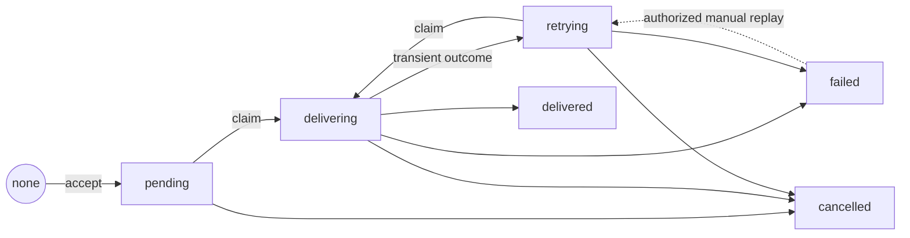

# Submission state machine

This document defines the durable lifecycle of an accepted submission while
Channels delivers its one logical turn to an agent. It covers inbound agent
delivery only. Agent execution, turn completion, response emissions, and
outbound channel delivery have separate lifecycles in later milestones.

The state is a mutable projection associated with the immutable
[submission envelope](./SUBMISSION-ENVELOPE.md). An implementation may later
store submission and logical delivery records separately, but the externally
visible submission status must preserve this state machine.

## States

| State        | Meaning                                                                 |
| ------------ | ----------------------------------------------------------------------- |
| `pending`    | Durably accepted and waiting for its first delivery attempt.            |
| `delivering` | One delivery attempt is active under a valid lease.                     |
| `retrying`   | A prior attempt did not succeed and a later attempt is scheduled.       |
| `delivered`  | The agent delivery contract was satisfied.                              |
| `failed`     | Channels stopped trying without satisfying the agent delivery contract. |
| `cancelled`  | Channels accepted a request to stop further delivery.                   |

`pending` is the initial committed state. Acceptance is an operation and an
acknowledgement outcome, not a separate durable state: the submission is not
accepted before its commit, and that same commit can make it pending. Adding an
`accepted → pending` transition would create an intermediate state with no
caller-visible meaning and another recovery path.

`retrying` is distinct from `pending` so status can explain whether delivery has
never been attempted or is waiting after an unsuccessful attempt. It contains
no active attempt. A retry schedule may make it temporarily ineligible for
dispatch.

`delivered`, `failed`, and `cancelled` are terminal for automatic processing.
Terminal does not mean the record is deleted. The submission, turn identity,
idempotency claim, and attempt history remain durable.

## Legal transitions

| From         | To           | Cause                                                                    |
| ------------ | ------------ | ------------------------------------------------------------------------ |
| none         | `pending`    | Atomic acceptance commit creates the submission and its initial status.  |
| `pending`    | `delivering` | A worker atomically claims the first attempt under a lease.              |
| `pending`    | `cancelled`  | Cancellation is committed before an attempt is active.                   |
| `delivering` | `delivered`  | The active attempt satisfies the agent delivery contract.                |
| `delivering` | `retrying`   | The active attempt has a retryable outcome or its lease expires.         |
| `delivering` | `failed`     | The outcome is permanent, or a configured retry or age limit is reached. |
| `delivering` | `cancelled`  | Cancellation is committed while an attempt is active.                    |
| `retrying`   | `delivering` | The retry is due and a worker atomically claims the next attempt.        |
| `retrying`   | `failed`     | A configured retry or age limit is reached before another attempt.       |
| `retrying`   | `cancelled`  | Cancellation is committed while waiting to retry.                        |
| `failed`     | `retrying`   | An authorized manual replay starts a new delivery cycle.                 |

All other transitions are illegal. In particular:

- duplicate acceptance leaves the existing state unchanged;
- active work cannot move backward to `pending`;
- `delivered` and `cancelled` cannot be replayed or reopened;
- `failed` cannot reopen because of a timer, restart, duplicate submission, or
  late attempt result;
- cancellation cannot become delivery success even if an escaped request later
  succeeds;
- no transition creates a new submission or turn.

The manual replay edge is the only exception to automatic terminality. It is an
explicit, authorized, audited operation, retains the existing submission and
turn IDs, and causes the next physical request to receive a new attempt ID.

## Transition rules

Every transition must be an atomic compare-and-set against the expected current
state. Transitions from `delivering` must additionally prove ownership of the
active attempt or lease. A stale worker may record its late result for
observability, but cannot mutate the current state.

The new state must be durable before it is returned by status inspection or
emitted to an observer. Scheduling a wakeup does not substitute for committing
the state and retry time. In-memory work may accelerate dispatch but is never
the source of truth.

Entering `delivering` and creating the attempt record are one atomic operation.
There is therefore no physical request without a corresponding attempt, and no
worker may start one unless the submission is `delivering` under its lease. A
request that already escaped may remain in flight after cancellation or lease
expiry, but it is no longer authorized to change the submission state. Detailed
attempt outcomes, timeout classification, retry policy, and lease fields are
defined by later roadmap items.

## State interpretation

### Delivery is not turn completion

`delivered` means Channels received a positive acknowledgement, attributable to
the selected agent target and bound to the stable turn ID, that the agent has
durably accepted responsibility for the turn. Channels may then stop retrying
agent delivery. A transport success alone, such as writing an HTTP request or
receiving an unbound `2xx` response, is insufficient.

This is the minimum semantic boundary needed by this state machine. Roadmap item
21 will define its concrete protocol, including authentication, response shape,
and how an agent deduplicates and durably records the turn before acknowledging
it. That protocol may refine how the condition is proven, but not weaken it.

The acknowledgement does not mean that the agent finished the turn or produced
a response.

### Composition with the full turn lifecycle

The full lifecycle is represented by related durable records rather than one
flat state machine:

1. This submission state records whether Channels accepted the inbound work and
   handed its stable turn to the agent.
2. The turn event lifecycle records progress, completion, agent failure, and
   turn cancellation, as defined in roadmap items 21–30.
3. Emission and channel-delivery lifecycles record whether agent output was
   accepted and delivered, as defined in later milestones.

These records are joined by the stable turn ID into one timeline. For example,
a submission can remain `delivered` while its turn later reports failure; both
facts are true and neither state overwrites the other. Likewise, once a
submission is `delivered`, cancellation acts on the turn rather than reopening
the completed submission-delivery lifecycle. This separation avoids a combined
state space such as “delivered-but-running-with-an-emission-retrying.”

### Retry is at least once

A transition from `delivering` to `retrying` can occur after a request escaped
to the agent but before Channels observed its acknowledgement. The next attempt
may therefore deliver the same turn again. It keeps the stable turn ID and gets
a new attempt ID.

### Cancellation is intent, not revocation

`cancelled` guarantees that Channels will not intentionally start another
attempt. If cancellation races with an active request, the request may still
reach or execute at the agent. A late result cannot move the submission out of
`cancelled`.

### Failure preserves replayability

`failed` records that automatic delivery stopped, not that delivery definitely
never occurred. It retains the last safe error classification and all attempt
history. Manual replay appends attempts rather than resetting counters or
rewriting prior outcomes.

## Crash and race outcomes

| Situation                                                               | Required state behavior                                                                  |
| ----------------------------------------------------------------------- | ---------------------------------------------------------------------------------------- |
| Crash before the acceptance commit.                                     | No state exists. A retry may create `pending`.                                           |
| Crash after acceptance but before dispatch scheduling.                  | `pending` remains durable and recovery can discover it.                                  |
| Crash after an attempt is claimed but before the request starts.        | `delivering` remains until lease expiry, then moves to `retrying`.                       |
| Crash after the request starts but before its result is recorded.       | Lease expiry moves `delivering` to `retrying`; duplicate agent receipt is possible.      |
| Cancellation wins its compare-and-set before an attempt claim.          | State becomes `cancelled`; the claim fails.                                              |
| Attempt claim wins before cancellation.                                 | Cancellation may move `delivering` to `cancelled`; the escaped request may still finish. |
| A stale attempt reports success after a newer attempt delivered.        | State remains `delivered`; the stale result cannot overwrite the winning outcome.        |
| A stale attempt reports success after cancellation or terminal failure. | State remains terminal; the late result is observational only.                           |
| Duplicate acceptance arrives in any state.                              | The original submission and current state are returned unchanged.                        |
| Process restarts while waiting to retry.                                | `retrying` and its durable schedule survive; it does not regress to `pending`.           |

## Deferred details

This state machine deliberately does not choose:

- the transport encoding and authentication mechanism for agent
  acknowledgement (roadmap item 21; the in-process boundary today requires a
  turn-bound acknowledgement per
  [AGENT-DELIVERY-CONTRACT.md](./AGENT-DELIVERY-CONTRACT.md));
- authorization policy for cancellation and replay (milestone 7);
- turn execution, event, emission, and outbound delivery states.

Several details this document originally deferred are now decided by roadmap
items 11–19 without adding externally visible transitions: attempt outcome
classification and timeout handling (`AGENT-DELIVERY-CONTRACT.md`), backoff,
jitter, lease, and terminal-limit shapes (`src/delivery-policy.ts`), and the
store-level cancellation, status, and replay APIs
(`src/storage/submission-store.ts`). Later decisions may add metadata and
internal substates, but they must not add externally visible transitions that
contradict this lifecycle.
