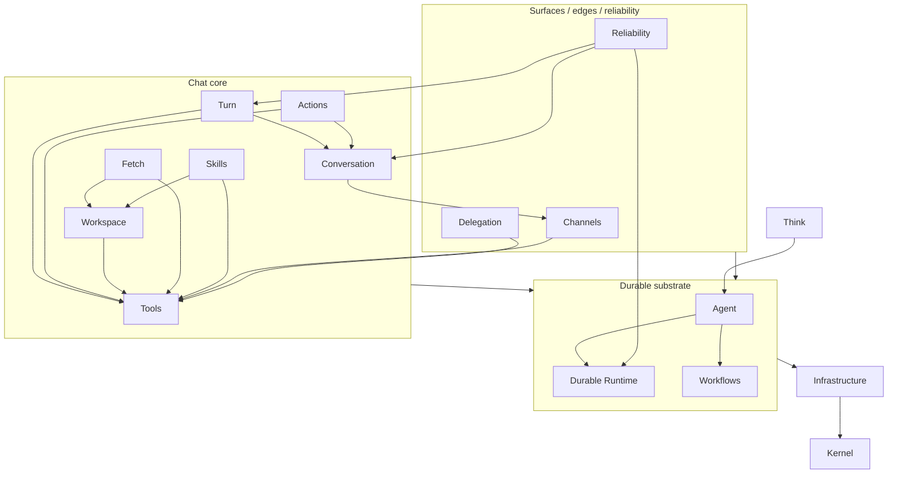

# Context Map

Bounded contexts for the clean-room rebuild of **Think** (an opinionated chat-agent
harness) on top of **Agent** (a Durable-Object base class). Each context has a
single, internally-consistent ubiquitous language.

The layering (`kernel → ports → domain → app → adapters`) is a *dependency* rule
and cuts across these contexts — code layout is not the same as a context. For
example the Turn context is the pure engine in `src/domain/turn/` but its wiring
lives in `src/app/think.ts`. Where a context does own a subtree, it's nested under
one directory with the glossary at the root (e.g. `src/domain/runtime/`).

This map is the index. Per-context glossaries (`CONTEXT.md`) live next to the code
they describe; every context now has one, at the location listed with it. System-wide
decisions live in [`docs/adr/`](./docs/adr/).

## Composition roots

Two thin wiring classes own no business logic; they compose the contexts:

- **Agent** (`app/agent.ts`) — wires the Durable Runtime services and owns the
  base-class lifecycle.
- **Think** (`app/think.ts`, `extends Agent`) — wires the chat contexts and
  orchestrates turns through `runTurnInternal`.

## Contexts

### Foundation

**1. Kernel** — pure primitives *you own*: zero I/O, zero state.
- **Owns:** IdSource, stable hash, canonical JSON, EventBus + observability
  event/channel taxonomy.
- **Location:** `src/kernel/`

**2. Infrastructure** — behavior-free *contracts for what you don't own*, plus
their implementations (the hexagonal boundary / anti-corruption layer to Cloudflare
+ the AI SDK). Implementations span the in-memory/fake set (for tests + e2e) and
production-shaped adapters (Anthropic model, node file-store/real-time, websocket-chat
transport, child-relay); Cloudflare Durable Object adapters remain future work.
- **Owns:** Port, Adapter; Clock, KeyValueStore, scoped store, AlarmTimer,
  Connection, ConnectionRegistry, ModelClient/ModelRequest/ModelChunk,
  ToolDescriptor, Sandbox, EmailTransport, WorkflowRuntime, ExternalToolSource,
  AgentSpawner/AgentHandle, FetchLike; MemoryHost, FakeModel.
- **Location:** `src/ports/`, `src/adapters/`

### Durable substrate

**3. Durable Runtime** — generic, stateful *durable-object capabilities* (not
chat- or even agent-specific): durable behavior built on the KV + alarm ports.
- **Owns:** Schedule/ScheduleSpec/Scheduler, alarm multiplexing, schedule DSL,
  wall-clock vs interval, KeepAlive; Fiber, run row, managed ledger, stash/
  snapshot, fiber recovery; TaskQueue; State (a durable observable JSON cell —
  transport-free per ADR 0001: `StateSource` is coarse `server`/`client`, with no
  connection identity); Callable/CallableRegistry (the RPC method registry).
- **Location:** `src/domain/runtime/` (nests scheduling, fibers, queue, state, rpc; glossary at the root)

**4. Agent** — the base-class *identity and lifecycle*: the one thing actually
"about the agent". Composition root, `onStart`/`onAlarm`/`destroy`, service
wiring, and hooks. Transport-free — it never holds a connection or parses a frame.
- **Location:** `src/app/agent.ts` (glossary at `src/app/CONTEXT.md`)

### Chat core

**5. Conversation** — what the conversation *is*, how it is persisted and shaped
for the model, and the durable outbound event stream that describes it. It also
absorbs the per-turn lifecycle glue run over the transcript (assembly, turn-state,
pending-interaction resolution). This is a deliberate "for now" call — any finer
subdivision (e.g. a dedicated "Chat Orchestration" context) is **deferred until the
code stabilizes**.
- **Owns:** ChatMessage, MessagePart, ToolPart (+ tool-part state), ModelMessage,
  role, transcript, transcript repair/RepairReport, MessageStore, row-size
  enforcement; Session, SessionBuilder, context block/provider, frozen prompt,
  history tree, compaction overlay; `UiChunk` + StreamAccumulator (folds `UiChunk`
  → ChatMessage); ConversationEventLog + ConversationEvent + relayTurn (the durable,
  offset-addressed outbound seam every transport adapter subscribes to; it absorbed
  the old resumable stream buffer's retention/replay); TurnAssembly/assembleTurn
  (shapes the frozen prompt + channel/skills/capability + merged toolset a turn runs
  with); PendingInteractions (client-tool/approval resolution + debounced
  continuation); ConversationTurnState (per-turn bookkeeping — its interrupted-partial
  commit is a Reliability edge).
- **Location:** `src/domain/{messages,session,events,conversation}/` — the former
  `domain/stream/` (chunks) and `domain/chat/` (assembly/continuation/turn-state)
  folders were dissolved into `domain/conversation/`. All four directories are
  single-context (the benign multi-directory case); no folder straddles contexts.

**6. Turn** — running one model interaction, narrowly: the pure engine + the
admission queue. It *consumes* assembled inputs (owned by Conversation) and *emits*
`UiChunk`s (also owned by Conversation); it neither prepares nor persists them.
- **Owns:** Turn, Step/StepResult, TurnEngine, TurnConfig/TurnContext/TurnHooks,
  Trigger, TurnOutcome (completed/suspended/aborted/error), stall watchdog,
  TurnQueue, admission (queue/replace/reject).
- **Location:** `src/domain/turn/`

**7. Tools** — the merged tool registry: the machinery every source feeds into.
- **Owns:** Tool/ToolSet/ToolDescriptor, client vs server tool, tool source +
  merge precedence, capability block, tool hooks/decisions, AssembledTools.
- **Location:** `src/domain/tools/`

**8. Workspace** — a durable virtual filesystem that happens to expose tools.
- **Owns:** Workspace, file record, WorkspaceEntry, dir marker, workspace tools,
  globToRegExp, truncateForModel.
- **Location:** `src/domain/workspace/`

**9. Fetch** — a conservative, allowlisted, off-by-default outbound HTTP tool.
- **Owns:** fetch tool, FetchToolConfig, allowlist, bare origin, binding, fixed
  headers, forbidden host, workspace spillover, fetch result.
- **Location:** `src/domain/fetch/`

**10. Skills** — on-demand instruction documents surfaced to the model.
- **Owns:** Skill/SkillDefinition, SKILL.md, frontmatter, SkillResource,
  SkillSource, SkillRegistry, catalog block, activate_skill, read_skill_resource.
- **Location:** `src/domain/skills/`

**11. Actions** — durable, approvable, per-turn-authorized tools. The richest
subsystem; it *compiles into* a Tool but speaks its own language.
- **Owns:** Action/ActionConfig, action kind (server/approval-gated/durable-pause),
  action ledger, idempotency/replay, approval flow, parked execution, approve/
  reject execution, permissions/grant, authorization decision, reply attachment.
- **Location:** `src/domain/actions/`

### Surfaces & edges

**12. Channels / Surfaces** — abstract per-surface policy and out-of-band
delivery, independent of any wire format.
- **Owns:** Channel (a surface a turn arrives on), ChannelKind, ChannelContext,
  ChannelDefinition, channel policy, channel stamping, notice, ChannelDelivery.
- **Location:** `src/domain/channels/`

**13. Reliability** — making turns survive eviction, stalls, overflow, and
untrusted callers.
- **Owns:** ChatRecovery, incident, recovery kind (retry/continue), exhaustion,
  terminal message, recovering status; OverflowGuard, chat-error classification,
  reactive/proactive compaction; Submission/SubmissionRecord, submission status,
  drain, FIFO isolation; declared task, occurrence, reconciliation, no-backfill.
- **Location:** `src/domain/reliability/` (nests recovery, submissions, scheduled-tasks; glossary at the root)

**14. Delegation** — an agent handing work to other agents.
- **Owns:** sub-agent, SubAgentRegistry, parentPath/selfPath; agent tool,
  agent-tool run, RunStatus, relay (its `ChildChatRelay`, built on the shared
  `relayTurn`), per-run event log (distinct from Conversation's
  `ConversationEventLog`), drill-in, recovery reconciliation, reportProgress.
- **Location:** `src/domain/delegation/`

**15. Workflows** — a local tracking table fronting Cloudflare Workflows bindings.
Wired by Agent, never Think.
- **Owns:** Workflow, tracking row/WorkflowInfo, WorkflowStatus, control methods,
  approval-via-sendEvent, onCallback, migrateBinding.
- **Location:** `src/domain/workflows/`

## Dependency diagram

Edges point from dependent → dependency. Universal edges are omitted for
legibility: **every context depends on Kernel + Infrastructure**, and **Think
composes all the chat contexts**.

## Notable cross-edges & shared types

- **ConversationEventLog is the transport seam** — the app layer publishes typed
  `ConversationEvent`s to a durable, offset-addressed log (Conversation); transport
  adapters subscribe and frame them. This is the boundary that keeps the app
  transport-free.
- **`UiChunk` is owned by Conversation** — *produced* by Turn's engine, then folded
  into a `ChatMessage` by the accumulator, carried as a `chunk` `ConversationEvent`,
  framed onto the wire by a transport adapter, and relayed via `relayTurn` by
  Delegation. Locating it with its consumers (accumulator + event log) keeps the
  Turn → Conversation dependency acyclic. The *chunk* is general; only the *framing*
  is adapter-specific.
- **State provenance** — the State container is transport-free (ADR 0001): its
  `StateSource` is coarse `server`/`client`, no connection identity. The Agent holds
  the richer `StateOrigin` (`server`/`client` + sourceId) and publishes it on the
  `state:changed` event; a transport adapter owns readonly rejection + origin
  exclusion using that sourceId.
- **RPC straddle** — the callable *registry* lives in Durable Runtime; the
  request/response *framing* over a connection is a transport-adapter concern.
- **Channel policy is a Conversation edge** — `assembleTurn` (Conversation) consumes
  a `ChannelPolicy`, so the dependency is `Conversation → Channels`. The Turn engine
  itself never imports Channels; it just runs the assembled inputs.
- **Delegation depends only on Tools** (plus the universal ports/kernel). It relates
  to Turn and Runtime *conceptually* — children run turns, run-reconciliation is
  fiber-like — but it reaches children through the `AgentSpawner`/`AgentHandle` port,
  never importing Turn or Runtime, so there is no code-level edge.
- **Reliability internals** — Submissions run turns through the TurnQueue;
  Scheduled Tasks arm Schedules (Durable Runtime) and feed Submissions.

## Overloaded-term watchlist

The same word means different things in different contexts. Keeping these
separated is the main reason the map is split the way it is:

| Word | Meaning A | Meaning B (and beyond) |
| ---- | --------- | ---------------------- |
| **channel** | Kernel: an observability category on the EventBus | Channels/Surfaces: a *surface* a turn arrives on (web/messenger/voice) |
| **chunk / delta** | Infrastructure: `ModelChunk` from the model port | Conversation: `UiChunk` (produced by Turn's engine); also RPC stream chunks (Durable Runtime) |
| **idempotency key** | Durable Runtime (Fibers): dedupes a managed fiber `start` | Reliability (Submissions): caller turn identity; Actions: ledger execution identity; Reliability (Tasks): per-occurrence identity |
| **continuation** | Turn: auto-continuation after tool results settle | Reliability: a recovery follow-up turn resuming from a partial |
| **replay** | Conversation: re-sending buffered `ConversationEventLog` chunks on reconnect | Actions: returning a settled ledger output without re-executing |
| **recovery / reconciliation** | Durable Runtime (Fibers): orphaned-run recovery | Reliability: chat recovery; Delegation: settling child runs; Reliability (Tasks): reconcile declarations |
| **run** | Durable Runtime: a fiber run row | Delegation: an agent-tool run |
| **event log** | Conversation: `ConversationEventLog` — the agent-wide durable outbound event stream | Delegation: a per-run parent-side append log of a child's relayed events |
| **relay** | Conversation: `relayTurn` — the shared primitive bridging log events onto a callback | Delegation: `ChildChatRelay` — a child dispatch's relay built on `relayTurn` |
| **source / origin** | Conversation/Tools: a *tool source* (origin of tools) | State: change *provenance* — coarse `StateOrigin` (Agent) vs the container's `StateSource` (Durable Runtime) |
| **status** | scoped per context (fiber, submission, workflow, run, stream, tool-part) — never a bare cross-context term | — |
| **suspended / aborted / recovering** | outcome vocabulary shared by Turn, Reliability, Fibers — always qualify by context | — |
